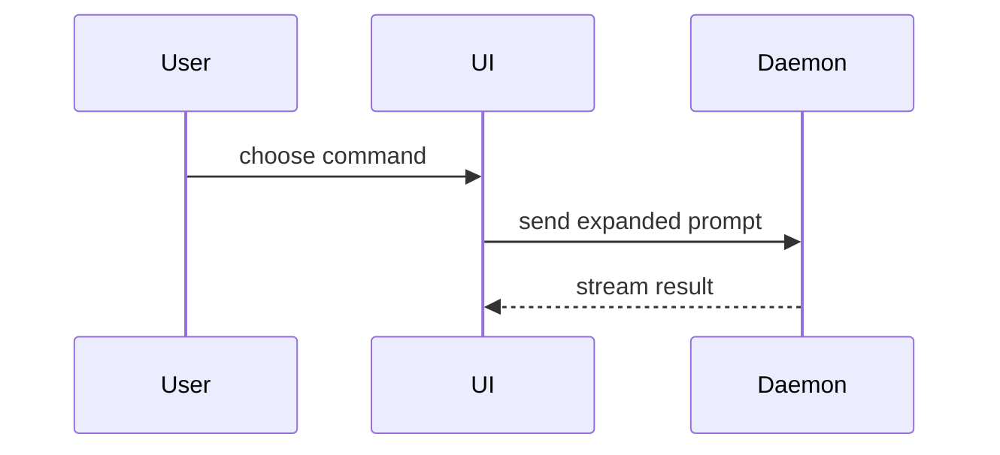

Help the user understand the current topic of conversation visually. Skip the preamble and keep prose brief.

## Default: write an HTML file and open it

Terminal-rendered diagrams read poorly. So unless an exception below applies, produce **one self-contained HTML file** and open it:

```
Bash(open /tmp/show-me-{slug}.html)
```

- Path: `/tmp/show-me-{slug}.html`, where `{slug}` is 2-4 kebab-case words naming the topic.
- `/tmp` is the default so the repo working tree stays clean. Write inside the repo only when the user asks to keep the artifact; then `docs/` or the path they name.
- After opening, leave 1-3 lines in chat: what the file shows and its path. Do not paste the HTML.

### Hard constraints on the HTML

- **Zero network dependencies.** No CDN, no Mermaid script, no Google Fonts, no external CSS or JS. The file must render fully offline. A CDN-loaded diagram library renders as a blank box on a flaky network — build diagrams from plain HTML + CSS instead (flexbox/grid boxes, CSS borders, unicode arrows `▶ ▼ └ ├ ──`).
- Single file. Inline `<style>` in `<head>`; inline `<script>` only if interaction genuinely helps.
- Match the product's colors, type, spacing, and components. Real labels and real data — never `foo`/`bar` placeholders.
- Responsive: readable at desktop width and on mobile. At least one `@media` breakpoint collapsing multi-column layouts to a single stack.
- Monospace blocks for code, trees, and pseudocode; keep them visually distinct from prose.

### Pick the smallest form that makes the point

- **Diagram** — one relationship, flow, or failure chain.
- **Infographic** — several linked facts that need ranking or comparison.
- **Short slide deck** — a sequence that only makes sense in order.

## Exceptions — answer inline in chat instead

Skip the file only when:

- The user asks for inline output ("inline", "in chat", "no file", "just paste it").
- The whole answer is a copyable snippet or diff under ~10 lines.
- The user is mid-flow and asked a yes/no or one-symbol question.

When inline, a fenced Mermaid block is fine — chat renders it. Never put Mermaid inside the HTML file.

## Content vocabulary

These are the shapes to render — inside the HTML by default, or fenced in chat when an exception applies. Use one or two; using all of them is a sign the view is too big.

Logic or an algorithm as pseudocode:

```text
on(save)
  if content is unchanged
    return cached result
  write new content
  return fresh result
```

Runtime control flow as a call tree:

```text
submitForm
  createSession
    persistPrompt
    launchAgent
  navigateToSession
```

UI structure as a component tree, including state and module boundaries that matter:

```tsx
<SessionPage> (apps/example/src/routes/session.tsx)
  useSessionEvents()
  <SessionToolbar>
    <RunSkillButton> (packages/ui)
```

File responsibility or a broad refactor as a shallow file tree:

```text
src/
├── commands/       # parses user actions
├── sessions/       # owns session state
└── transport/      # sends API requests
```

Component interaction, control flow, or data flow as a flow or sequence — hand-built boxes and arrows in the HTML, Mermaid when inline:



Use a **diff** when the point is what changes and the surrounding shape already exists. Match the diff shape to the topic — component change, file layout, call tree, or control flow:

```diff
 on(save)
-  write content
+  if content is unchanged
+    return cached result
+  write new content
+  invalidate cache
```

Show the **whole block** when most of it is new, when omitted context would hide ownership or order, or when the user needs a copyable target shape:

```ts
function expandSkill(command: string): string {
  const skillName = command.slice(1);
  return `use the ${skillName} skill`;
}
```

## Guidance

Place each visual next to the short text it supports. Keep only the calls, files, props, states, and boundaries needed to answer the user's current question or to resolve the current discussion point. Cutting detail is the job — an exhaustive diagram answers nothing.

## Before opening the file

- Renders with the network off — no external `src`/`href`.
- Every label is a real name from this codebase or conversation.
- One `@media` breakpoint present; no horizontal scroll on mobile.
- Smallest form that makes the point; nothing decorative survived.
