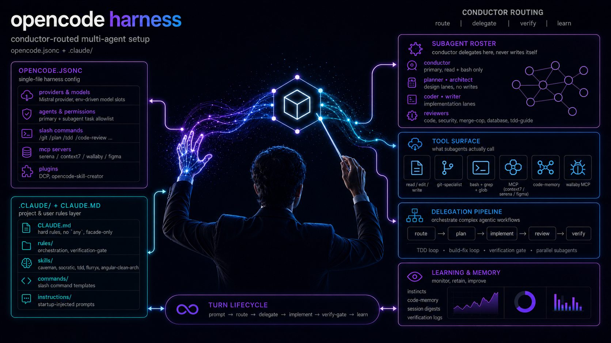

<p align="center">
  
</p>

<p align="center">
  <a href="https://github.com/fmflurry/code-memory"></a>
  <a href="LICENSE"></a>
  <a href="https://opencode.ai"></a>
  <a href="https://claude.com/claude-code"></a>
</p>

> ### Powered by [**CodeMemory**](https://github.com/fmflurry/code-memory)
>
> The semantic backbone of this harness. CodeMemory indexes the whole repo into a queryable memory of files, symbols, and episodes — so every agent walks into a session **already knowing the codebase** instead of grepping it back into existence on every turn.
>
> - **Orientation, not scanning.** One `code-memory_codememory_retrieve` call surfaces the right paths, symbols, and prior decisions; `grep`/`read` only run afterwards for exact verification.
> - **Cross-session memory.** Episodes and findings persist — agents pick up where the last session left off instead of re-discovering the repo from scratch.
> - **Wired in by default.** `instructions/codememory-first.md` is loaded at session start, and `code-memory_*` tools are pre-allowlisted for the conductor and every specialist subagent.

# OpenCode + Claude Code Setup

> My personal **OpenCode** and **Claude Code** configuration, kept public so I can sync it across machines — and so anyone curious can borrow what's useful. MIT licensed, fork freely. It evolves with my workflow, so treat it as a living reference rather than a stable distribution.

### Want to try it? Jump to **[Public install](#public-install)** — it takes about five minutes.

---

## What's inside

A hardened primary `conductor` agent backed by **13 specialist sub-agents** (planner, architect, coder, writer, code/security/database review, TDD, build-fix, e2e, doc, refactor, git), wired together by:

- **Mandatory sub-agent delegation** from `conductor`: the primary has `write` and `edit` denied at the permission layer, plus a `tool.execute.before` hook that blocks bash redirects to source files (`> file.ts`, `tee`, `sed -i`, heredocs, `python -c open().write`). The orchestrator cannot patch files — every change MUST go through `coder` (source code), `writer` (docs/markdown/HTML), `tdd-guide` (tests), or `git-specialist` (commits/PRs). This makes routing **model-agnostic**: even open-weight models that ignore prose rules are mechanically forced to delegate.
- **Front-loaded first-tool gate** in `prompts/agents/conductor.txt`: hard rules at the top, routing table second, six few-shot User → `task` examples (with explicit wrong-way contrasts) so literal models copy the right pattern.
- **Slash commands** that force routing to the right specialist (`/plan`, `/tdd`, `/security`, `/cop-review`, …).
- **Always-on skills** loaded at session start — Socratic design, security review, coding standards, git workflow, [CodeMemory-first](https://github.com/fmflurry/code-memory) repo orientation.
- **OpenCode plugins** — ECC hooks (Prettier + `tsc` on save), worktree spawner, auto-compact, caveman ultra mode, Figma RAG trigger, desktop notifications with optional Bark/iPhone push.
- **Custom tools** — `run-tests`, `check-coverage`, `security-audit`, plus a codemap generator.
- **A `.claude/` mirror** — hooks, rule packs, and skills, so Claude Code benefits from the same guardrails.

The two halves stand alone. Use the OpenCode side, the Claude Code mirror, or both — whichever you'd find useful.

## Table of contents

- [Public install](#public-install)
- [English](#english)
  - [Goals](#goals-en)
  - [Repository layout](#layout-en)
  - [Configuration](#config-en)
  - [Agents](#agents-en)
  - [Slash commands](#commands-en)
  - [Skills](#skills-en)
  - [Plugins & hooks](#plugins-en)
  - [Custom tools](#tools-en)
  - [TUI plugins](#tui-en)
  - [Claude Code mirror](#claude-en)
  - [How it fits together](#flow-en)
- [Français](#francais)
  - [Objectif](#objectif-fr)
  - [Structure du repo](#structure-fr)
  - [Configuration](#config-fr)
  - [Agents](#agents-fr)
  - [Commandes slash](#commands-fr)
  - [Skills](#skills-fr)
  - [Plugins & hooks](#plugins-fr)
  - [Outils custom](#tools-fr)
  - [TUI plugins](#tui-fr)
  - [Mirror Claude Code](#claude-fr)
  - [Comment tout s'emboite](#flow-fr)

---

<a id="public-install"></a>

## Public install

The repo is designed to merge into `~/.config/opencode/`, plus an optional `~/.claude/` mirror. There are three paths: a **one-line install** (recommended — nothing to clone by hand), a one-shot script if you already have the repo, and a manual walk-through if you want to see every step.

### One-line install

You don't need to clone anything first. The bootstrap fetches the repo into `~/.local/share/settings-opencode` (override with `SETTINGS_OPENCODE_SRC`), then runs the installer. **Re-running the exact same command is also how you update** — it pulls the latest and re-applies it.

**macOS / Linux / WSL** (bash):

```bash
curl -fsSL https://raw.githubusercontent.com/fmflurry/settings-opencode/master/bootstrap.sh | bash
```

On WSL it installs to the **Windows** side (`/mnt/c/Users/<you>/.config/opencode`), matching `install.sh`'s WSL behaviour. Pass installer flags through after `-s --`:

```bash
curl -fsSL https://raw.githubusercontent.com/fmflurry/settings-opencode/master/bootstrap.sh | bash -s -- --local
curl -fsSL https://raw.githubusercontent.com/fmflurry/settings-opencode/master/bootstrap.sh | bash -s -- --no-claude
curl -fsSL https://raw.githubusercontent.com/fmflurry/settings-opencode/master/bootstrap.sh | bash -s -- --uninstall
```

**Native Windows** (PowerShell — no WSL):

```powershell
irm https://raw.githubusercontent.com/fmflurry/settings-opencode/master/bootstrap.ps1 | iex
```

Merges into `%USERPROFILE%\.config\opencode` and `\.claude`, runs `npm install` (or `bun install`), and writes the `OPENCODE_*` defaults as **persistent User environment variables**. Open a new terminal afterwards so they take effect. Variants:

```powershell
# project-scoped install
& ([scriptblock]::Create((irm https://raw.githubusercontent.com/fmflurry/settings-opencode/master/bootstrap.ps1))) -Local
# skip the Claude mirror
& ([scriptblock]::Create((irm https://raw.githubusercontent.com/fmflurry/settings-opencode/master/bootstrap.ps1))) -NoClaude
# skip OpenCode (install Claude only)
& ([scriptblock]::Create((irm https://raw.githubusercontent.com/fmflurry/settings-opencode/master/bootstrap.ps1))) -NoOpencode
# uninstall (removes the OPENCODE_* env vars; leaves copied config in place)
& ([scriptblock]::Create((irm https://raw.githubusercontent.com/fmflurry/settings-opencode/master/bootstrap.ps1))) -Uninstall
```

### Prerequisites

- macOS, Linux, WSL, or native Windows (worktree support is best on macOS; notifications use desktop delivery plus optional Bark/iPhone pushes).
- [OpenCode CLI](https://opencode.ai) installed and on your `PATH` (unless installing Claude Code only via `--no-opencode`).
- [Claude Code](https://claude.com/claude-code) installed if you want the `.claude/` mirror (unless skipped via `--no-claude`).
- Either [Bun](https://bun.sh) (recommended — `bun.lock` is what's checked in) or Node.js 20+ with `npm`.
- `git`.

### Quick install (script)

Already have the repo cloned? Run the installer directly:

```bash
git clone https://github.com/fmflurry/settings-opencode.git ~/Workspace/settings-opencode
cd ~/Workspace/settings-opencode
./install.sh
```

`install.sh` is interactive by default. It will prompt for each of two independent targets (OpenCode and Claude Code):

1. Verify your prerequisites (`git`, `bun`/`npm`).
2. **OpenCode** (if selected): merge repo files into `~/.config/opencode` (or `./.opencode` if `--local`) without removing existing user config.
3. Run `bun install` (or `npm ci` if Bun isn't available).
4. Sync skills from the canonical set into both harnesses via `scripts/sync-skills.sh`.
5. Seed personal config files (`settings.json`, `settings.local.json`, `policy-limits.json`) **only on first install**; preserve user edits on reinstall.
6. Add the `OPENCODE_MODEL_*` and `OPENCODE_REASONING_*` defaults to your shell rc, fenced with markers so re-runs and uninstalls are idempotent (OpenCode only, skipped if `--local`).
7. **Claude Code** (if selected): merge `.claude/` into `~/.claude` (or `./.claude` if `--local`).
8. Print a smoke-test command and the locations to tweak afterwards.

Useful flags:

| Flag            | Behaviour                                                                                                                                                                                   |
| --------------- | ------------------------------------------------------------------------------------------------------------------------------------------------------------------------------------------- |
| _(none)_        | Interactive walk-through: prompt `[Y/n]` for OpenCode (default Y) and Claude Code (default Y).                                                                                               |
| `--yes`, `-y`   | Non-interactive — accept all defaults: OpenCode ✓, Claude Code ✓. Existing normal directories are merged, not removed or backed up.                                                           |
| `--local`       | Project-scoped install into the current directory (`./.opencode`, `./.claude` as independent siblings); skips the global shell-rc env block (prints it as a hint instead).                   |
| `--opencode`    | **Allow-list:** install OpenCode only (if combined with other flags, only those are installed).                                                                                             |
| `--claude`      | **Allow-list:** install Claude Code only.                                                                                                                                                   |
| `--no-opencode` | **Deny:** skip OpenCode entirely (repo copy, deps, and env block). Can be combined with other targets.                                                                                      |
| `--no-claude`   | **Deny:** skip the Claude Code mirror. Can be combined with other targets.                                                                                                                  |
| `--uninstall`   | Remove the env-var block and optionally remove copied local/global dirs after confirmation. **Never deletes the cloned repo or your data without confirmation.**                               |
| `--help`, `-h`  | Print usage.                                                                                                                                                                                |

The script writes a fenced block to your shell rc (`~/.zshrc`, `~/.bashrc`, or `~/.config/fish/config.fish`) that looks like this:

```bash
# >>> settings-opencode >>>
# Added by settings-opencode installer. Edit values to match your provider.
export OPENCODE_MODEL_PRIMARY="anthropic/claude-sonnet-4-6"
export OPENCODE_MODEL_SUBAGENT_PLANNER="anthropic/claude-opus-4-7"
export OPENCODE_MODEL_SUBAGENT_WORKER="anthropic/claude-sonnet-4-6"
export OPENCODE_MODEL_SUBAGENT_MINI="anthropic/claude-haiku-4-5"
export OPENCODE_REASONING_PRIMARY="high"
export OPENCODE_REASONING_SECONDARY="medium"
export OPENCODE_REASONING_TERTIARY="low"
# <<< settings-opencode <<<
```

Edit the values inside the markers to point at whichever provider you use. Re-running `./install.sh` rewrites the same block; `./install.sh --uninstall` removes it cleanly.

If your shell isn't bash/zsh/fish, the script prints the env block for you to paste manually and continues with the rest of the install.

### Manual install

<details>
<summary>Click to expand the step-by-step manual walk-through (same outcome as the script).</summary>

#### 1. Clone the repo, then merge it into the OpenCode config dir

OpenCode loads `~/.config/opencode/opencode.jsonc` at startup. Keep the repo wherever you like, then copy it additively into the config dir.

```bash
# Clone
git clone https://github.com/fmflurry/settings-opencode.git ~/Workspace/settings-opencode
mkdir -p ~/.config/opencode
rsync -a --exclude node_modules --exclude .git ~/Workspace/settings-opencode/ ~/.config/opencode/
cd ~/.config/opencode
```

#### 2. Install plugin/tool dependencies

```bash
bun install        # uses bun.lock
# or
npm ci
```

#### 3. Set the model + reasoning environment variables

The `agent` block in `opencode.jsonc` is parameterized via env vars so you can swap providers without editing the config. Add these to your shell profile (`~/.zshrc`, `~/.bashrc`, etc.):

```bash
# Required (OpenCode model identifiers — adjust to whatever provider you use)
export OPENCODE_MODEL_PRIMARY="anthropic/claude-sonnet-4-6"
export OPENCODE_MODEL_SUBAGENT_PLANNER="anthropic/claude-opus-4-7"
export OPENCODE_MODEL_SUBAGENT_WORKER="anthropic/claude-sonnet-4-6"
export OPENCODE_MODEL_SUBAGENT_MINI="anthropic/claude-haiku-4-5"

# Reasoning effort tiers
export OPENCODE_REASONING_PRIMARY="high"
export OPENCODE_REASONING_SECONDARY="medium"
export OPENCODE_REASONING_TERTIARY="low"
```

If your provider doesn't support `reasoningEffort`, OpenCode silently ignores it — pick any value.

#### 4. Install MCP server prerequisites

`opencode.jsonc` declares three MCP servers, plus an externally-registered fourth one (`code-memory`). **CodeMemory is strongly recommended** — `instructions/codememory-first.md` routes repo orientation through it before falling back to `grep`/`read`. The others are optional but documented here so you know what you're opting into.

| Server      | Install                                                                                                      | Status                                                                                                                                                   |
| ----------- | ------------------------------------------------------------------------------------------------------------ | -------------------------------------------------------------------------------------------------------------------------------------------------------- |
| code-memory | register externally (user-level MCP) — see [`fmflurry/code-memory`](https://github.com/fmflurry/code-memory) | **Recommended.** Semantic repo orientation; `code-memory_*` tools are pre-allowlisted for every subagent. Pairs with `instructions/codememory-first.md`. |
| context7    | nothing — `npx -y @upstash/context7-mcp@latest` is auto-installed at session start                           | Live docs lookup. Auto-bootstraps on first use.                                                                                                          |
| wallaby     | install [Wallaby.js](https://wallabyjs.com) and run `wallaby update-mcp`                                     | Optional. Runtime-test introspection.                                                                                                                    |
| Figma       | `enabled: false` by default                                                                                  | Optional. Flip `enabled: true` and set up [Figma MCP](https://help.figma.com) for design-system tools.                                                   |

#### 5. (Optional) Install the Claude Code mirror

The repo ships a `.claude/` subtree. OpenCode and Claude Code can be installed separately and never nest inside one another.

**Claude Code:**

```bash
mkdir -p ~/.claude
rsync -a ~/.config/opencode/.claude/ ~/.claude/
```

What this installs:

- `.claude/CLAUDE.md` — global user instructions Claude Code reads on every session.
- `.claude/settings.json` — permissions, hooks, env vars (`API_TIMEOUT_MS`, autocompact threshold, etc.). Seeded on first install only; user edits preserved on reinstall.
- `.claude/hooks/*.sh` — pre-tool-use security warnings + stop hook.
- `.claude/rules/{common,typescript}/*.md` — coding-style/testing/security rule packs.
- `.claude/commands/*.md` — extra slash commands (`/create-pull-request`, `/update-codemaps`).
- `.claude/skills/**` — **full parity copy of canonical skill set** (same as `skills/` at repo root, computed and synced by `scripts/sync-skills.sh`). Includes all OpenCode skills; both sides stay in sync.

</details>

### Smoke test

```bash
opencode
```

You should see:

- The caveman ultra TUI sidebar plugin show up (or be silent if you're not in a caveman session).

Then drop a slash command:

```
/plan add a TODO list to my homepage
```

It should route to the `planner` sub-agent and return a structured plan without writing code.

### Updating

If you installed via the one-liner, **re-run the exact same command** — it pulls the latest and re-applies it:

```bash
# macOS / Linux / WSL
curl -fsSL https://raw.githubusercontent.com/fmflurry/settings-opencode/master/bootstrap.sh | bash
```

```powershell
# native Windows
irm https://raw.githubusercontent.com/fmflurry/settings-opencode/master/bootstrap.ps1 | iex
```

If you cloned the repo by hand instead:

```bash
cd ~/.config/opencode
git pull
./install.sh --yes        # refreshes deps + env block; idempotent
# or, if you want to do it by hand:
# bun install   (or: npm ci)
```

If a new plugin shows up, OpenCode picks it up on the next restart. If an env var is added to `opencode.jsonc`, this README will mention it.

---

<a id="english"></a>

## English

Dotfiles for OpenCode + the stable parts of `~/.claude`. Ships a hardened primary `conductor` agent (no write/edit perms — must delegate), 13 specialist sub-agents, always-on skills, slash commands, OpenCode plugins (hooks, worktrees, auto-compact, caveman, figma RAG, notifications), custom tools, and a Claude Code mirror.

<a id="goals-en"></a>

### Goals

- Reproducibility: same agent behavior across machines/sessions.
- Quality: on-demand TDD, frequent verification, centralized conventions.
- Security: `security-review` skill loaded by default + pre-tool-use hooks.

<a id="layout-en"></a>

### Repository layout

- Configs: `opencode.jsonc`, `dcp.jsonc` (dynamic context pruning), `tui.json` (TUI theme).
- Profiles: `profiles/<name>/` (per-profile overrides + `AGENTS.md`).
- Skills: `skills/*/SKILL.md` (plus auxiliary docs) — **canonical set, shared with Claude Code via** `sync-skills.sh`.
- Agent prompts: `prompts/agents/*.txt`.
- Slash commands: `commands/*.md`.
- OpenCode plugins: `plugins/*.{ts,js}` + `plugins/kdco-primitives/`, `plugins/worktree/`.
- TUI plugins: `tui-plugins/*.tsx`.
- Custom tools: `tools/*.ts`.
- Mode notes: `contexts/*.md`.
- Global instructions: `instructions/subagent-routing.md`, `instructions/codememory-first.md`, `instructions/caveman-ultra.md`.
- Scripts: `scripts/setup-package-manager.js`, `scripts/codemaps/generate.ts`, `scripts/sync-skills.sh` (sync canonical skill set to both harnesses).
- Claude mirror: `.claude/CLAUDE.md`, `.claude/settings.json`, `.claude/hooks/`, `.claude/rules/`, `.claude/skills/` (full parity copy), `.claude/commands/`.
- Intentional exclusions (`.gitignore`): `node_modules/`, `antigravity-*`, `.DS_Store`, local `.env*` files except `.env.example`, runtime dir `skills/skill-creator/` (not synced).

<a id="config-en"></a>

### Configuration: `opencode.jsonc`

Six concerns wired in one file:

1. `instructions`: always-on skills loaded at session start. Currently:
   - `instructions/subagent-routing.md` — Task-first subagent delegation gate.
   - `instructions/codememory-first.md` — prefer [CodeMemory](https://github.com/fmflurry/code-memory) MCP (`code-memory_*` tools) for repo orientation before `grep`/`read`.
   - `skills/socratic-design/SKILL.md` — evidence-first decision gating.
   - `skills/security-review/SKILL.md` — OWASP checklist.
   - `skills/coding-standards/SKILL.md` — code conventions.
   - `skills/git-workflow/SKILL.md` — branches, commits, PRs.
2. `default_agent`: `conductor` (orchestrator-only — cannot write/edit).
3. `agent`: sub-agent definitions (model + reasoning effort + prompt + tool allowlist). All models are env-driven (`OPENCODE_MODEL_*`, `OPENCODE_REASONING_*`) — see [Public install § 4](#public-install).
4. `command`: maps `/<name>` -> template + sub-agent + `subtask`.
5. `mcp`: context7, wallaby, Figma (disabled). Plus externally-registered [`code-memory`](https://github.com/fmflurry/code-memory) — tool perms `code-memory_*` are pre-allowlisted for every subagent.
6. `plugin`: external marketplace plugins (`@tarquinen/opencode-dcp@latest`).

`dcp.jsonc` configures the Dynamic Context Pruning plugin.

<a id="agents-en"></a>

### Agents

Defined in `opencode.jsonc` under `agent`:

| Agent                  | Mode     | Role                                                                                                                                                                              |
| ---------------------- | -------- | --------------------------------------------------------------------------------------------------------------------------------------------------------------------------------- |
| `conductor`            | primary  | Orchestrator. `write` + `edit` **denied** at the permission layer. Routes every change to a specialist via Task. Bash redirects to source files blocked by the ECC pre-tool hook. |
| `planner`              | subagent | Plan + risks before large changes. Read+bash, no edit.                                                                                                                            |
| `architect`            | subagent | System design / scalability decisions. Read+bash only.                                                                                                                            |
| `coder`                | subagent | Pure non-test implementation. Mandatory build+lint+standards self-check before reporting done. Socratic ambiguity gate.                                                           |
| `writer`               | subagent | Writes docs/markdown/HTML/text artifacts. Forbidden from touching source code — refuses out-of-scope files back to the conductor.                                                 |
| `code-reviewer`        | subagent | Quality review over diffs and conventions. Read-only — findings only; fixes go to `coder`.                                                                                        |
| `security-reviewer`    | subagent | OWASP/secrets/deps review. Read-only — reports vulnerabilities; remediation routed to `coder`.                                                                                    |
| `tdd-guide`            | subagent | RED -> GREEN -> REFACTOR + 80% coverage. Writes tests; delegates GREEN impl to `coder` via scoped Task perm.                                                                      |
| `build-error-resolver` | subagent | Build/TS error fixes with minimal diffs.                                                                                                                                          |
| `e2e-runner`           | subagent | Playwright E2E tests.                                                                                                                                                             |
| `doc-updater`          | subagent | Generated docs + codemaps.                                                                                                                                                        |
| `refactor-cleaner`     | subagent | Dead-code removal + consolidation.                                                                                                                                                |
| `database-reviewer`    | subagent | PostgreSQL / Supabase schema, perf, security.                                                                                                                                     |
| `git-specialist`       | subagent | Branches, commits, pushes, PRs (mini model).                                                                                                                                      |

### Hardened sub-agent orchestration

Delegation is enforced at **three layers**, so the same behavior holds whether the primary model is Claude, GPT, DeepSeek, or any open-weight runner that ignores prose hints:

1. **Permissions** — `conductor` has `tools.write: false`, `tools.edit: false`, and `permission.edit/write: deny` in `opencode.jsonc`. The Task allowlist enumerates every legal specialist; `*: deny` blocks anything else. The orchestrator literally has no file-mutation tool.
2. **Pre-tool hook (`plugins/ecc-hooks.ts`)** — defense in depth: blocks bash commands that would write to source files via shell redirect (`>`, `>>`), `tee`, `sed -i`, heredocs, or `python -c open().write`. Throws aborting the tool call with an explicit "delegate to coder/writer/tdd-guide" message. Applies globally — no subagent should be writing code through bash either.
3. **Front-loaded prompt (`prompts/agents/conductor.txt`)** — hard rules in the first lines, routing table second, six worked few-shot examples showing User → `task` calls with explicit wrong-way contrasts. `instructions/subagent-routing.md` enforces a Task-first gate before direct inspection.

Use these paths depending on how much control you want:

- Plain request: `conductor` consults the routing table and dispatches the matching specialist via Task.
- `@agent` mention: manually invokes a specific subagent in the conversation.
- Slash command: forces a subtask with a configured template, e.g. `/plan`, `/tdd`, `/security`.

Why this exists: GPT/Claude often infer delegation from short descriptions, but open-source/open-weight models are more literal and tend to inspect or edit first. Permissions + the hook + the front-loaded gate make delegation **mechanically enforced** rather than instruction-dependent.

<a id="commands-en"></a>

### Slash commands

Templates in `commands/`. Most run as `subtask: true` (delegated to a specialist).

| Command            | Sub-agent            | Purpose                              |
| ------------------ | -------------------- | ------------------------------------ |
| `/git`             | git-specialist       | Bounded git ops (branches, commits). |
| `/push-changes`    | git-specialist       | Commit + push with upstream guard.   |
| `/plan`            | planner              | Implementation plan.                 |
| `/tdd`             | tdd-guide            | TDD cycle with coverage.             |
| `/cop-review`      | code-reviewer        | Quality review.                      |
| `/security`        | security-reviewer    | Security audit.                      |
| `/build-fix`       | build-error-resolver | Build/TS error resolution.           |
| `/e2e`             | e2e-runner           | E2E test generation/run.             |
| `/refactor-clean`  | refactor-cleaner     | Dead-code cleanup.                   |
| `/orchestrate`     | planner              | Multi-agent orchestration.           |
| `/update-docs`     | doc-updater          | Doc updates.                         |
| `/update-codemaps` | doc-updater          | Generates `docs/CODEMAPS/`.          |
| `/test-coverage`   | tdd-guide            | Coverage analysis.                   |
| `/verify`          | (primary)            | Verification loop.                   |
| `/eval`            | (primary)            | Evaluate against criteria.           |
| `/skill-create`    | (primary)            | Generate a skill from git history.   |

<a id="skills-en"></a>

### Skills

**All skills are kept at full parity across OpenCode (`skills/`) and Claude Code (`.claude/skills/`) via the canonical union computed and synced by `scripts/sync-skills.sh`.** Both `skills/` (root, source of truth) and `.claude/skills/` (mirror) are self-contained; a raw `cp -R .claude ~/.claude` yields a complete skill set.

Always-on (declared in `instructions`):

- `skills/socratic-design/SKILL.md` — evidence-first decision gating.
- `skills/security-review/SKILL.md` — security checklist + scenarios.
- `skills/coding-standards/SKILL.md` — naming, immutability, file size, error handling.
- `skills/git-workflow/SKILL.md` — branches, conventional commits, push guards.

On-demand (loaded by description / by command):

- `skills/tdd-workflow/SKILL.md` — full TDD methodology.
- `skills/caveman/SKILL.md`, `caveman-commit`, `caveman-review` — terse mode.
- `skills/strategic-compact/SKILL.md` — manual compaction at logical breakpoints.
- `skills/dotnet-clean-architecture/SKILL.md` (+ playbooks) — .NET 8 BFF scaffolding.
- `skills/angular-clean-architecture/SKILL.md` (+ store, migration, testing) — Angular 18 standalone scaffolding.
- `skills/angular-cop/SKILL.md` — Angular + TS pre-merge review rules.
- `skills/dotnet-cop/SKILL.md` — .NET pre-merge review rules.
- `skills/angular-accessibility/SKILL.md` — Angular ARIA audit.
- `skills/compress/SKILL.md` — context compression.
- `skills/flurryx/SKILL.md` — domain-specific patterns.
- `skills/ddd-type-duplication-across-layers/SKILL.md` — union-type scaffolding across DDD layers.
- `skills/transloco/SKILL.md` — Transloco i18n management.
- `skills/transloco-testing-flat-keys/SKILL.md` — Transloco testing helpers.

**Sync behavior:** `scripts/sync-skills.sh` computes the canonical union (root `skills/` ∪ `.claude/skills/`, root wins on conflicts), excludes runtime dir (`skills/skill-creator/`), and copies into the given destination(s). Runs standalone and is invoked by installers.

<a id="plugins-en"></a>

### Plugins & hooks

All TypeScript plugins use `@opencode-ai/plugin@1.4.6`.

- `plugins/ecc-hooks.ts` — Prettier on edited JS/TS, `console.log` detection, sensitive-command reminders (`git push` etc.), and the **conductor hard-stop**: aborts bash redirects (`>`, `>>`, `tee`, `sed -i`, heredocs, `python -c open().write`) targeting source files so delegation cannot be bypassed via shell.
- `plugins/auto-compact.js` — auto-compacts once `OC_COMPACT_THRESHOLD` tool calls are reached, only while idle.
- `plugins/notification.js` — desktop notifications on conductor `message.updated` completions and question/permission events; permission events and top-level completions can also push to iPhone via Bark.
- `plugins/caveman-server.ts` + `tui-plugins/caveman.tsx` — injects caveman instructions into the system prompt + TUI sidebar showing active mode.
- `plugins/figma-mcp-trigger.js` — Figma RAG: reads `figma-rag.md` (or `OPENCODE_FIGMA_RAG_PATHS`) and injects snippets when designs are referenced.
- `plugins/worktree.ts` (+ `plugins/worktree/`) — creates an isolated git worktree for the session and spawns a terminal (mac/Win/Linux). Inspired by opencode-worktree-session.
- `plugins/kdco-primitives/` — shared utilities (mutex, shell, terminal-detect, project-id resolver, types).
- `@tarquinen/opencode-dcp@latest` _(external, declared in `opencode.jsonc › plugin`)_ — Dynamic Context Pruning. Trims stale tool results and large files from the live context window so long sessions don't blow past the model's limit. Configured via `dcp.jsonc` at the repo root.

<a id="tools-en"></a>

### Custom tools (`tools/`)

Reusable OpenCode tools exposed via `tools/index.ts`:

- `tools/run-tests.ts` — detects package manager + framework and builds the test command.
- `tools/check-coverage.ts` — reads coverage reports and compares against a threshold.
- `tools/security-audit.ts` — scans deps + secrets + risky patterns.

<a id="tui-en"></a>

### TUI plugins

`tui-plugins/caveman.tsx` — React sidebar that shows a "CAVEMAN ULTRA" badge when the mode is active (flag file written by `caveman-server.ts`).

<a id="claude-en"></a>

### Claude Code mirror (`.claude/`)

- `CLAUDE.md` — global user instructions (no `any`, facade != UseCase).
- `settings.json` — allow/deny permissions, env (`API_TIMEOUT_MS=3000000`, `CLAUDE_CODE_DISABLE_NONESSENTIAL_TRAFFIC=1`, `CLAUDE_AUTOCOMPACT_PCT_OVERRIDE=80`), `PreToolUse` / `PostToolUse` / `Stop` hooks. Seeded on first install; personal edits preserved on reinstall.
- `hooks/pre-tool-use.sh` — warning-only checks on sensitive commands/files.
- `hooks/stop.sh` — Claude Code stop hook.
- `rules/common/*.md` + `rules/typescript/*.md` — rule packs (style, testing, security, patterns, hooks, agents).
- `commands/{create-pull-request,update-codemaps}.md` — Claude commands.
- `skills/**` — **full parity copy of canonical skill set** (synced via `scripts/sync-skills.sh`). Both OpenCode and Claude Code see the same skills; updates to root `skills/` propagate to `.claude/skills/` on install/sync.

<a id="flow-en"></a>

### How it fits together

1. Startup: OpenCode loads `opencode.jsonc` -> always-on instructions -> `caveman-server` adds caveman preamble if active.
2. Dev: `conductor` executes — it cannot write files; it dispatches Task calls to specialists. `ecc-hooks` formats / flags `console.log` / blocks bash-write bypasses.
3. Workflow: `conductor` routes to specialists through Task (perm-enforced); `/plan`, `/tdd`, `/security`, etc. force the same routing explicitly.
4. Idle/completion: `auto-compact` triggers when the tool-call threshold is reached; `notification` sends desktop alerts for `message.updated` completions plus question/permission events, with optional Bark/iPhone pushes.

---

<a id="francais"></a>

## Français

Depot "dotfiles" pour OpenCode + la partie stable de `~/.claude`. Embarque un agent principal `conductor` durci (write/edit interdits, delegation obligatoire), treize sous-agents specialises, des skills toujours actives, des commandes slash, des plugins (hooks, worktrees, auto-compact, caveman, figma RAG), des outils custom et un mirror Claude Code.

<a id="objectif-fr"></a>

### Objectif

- Reproductibilite: meme comportement entre machines/sessions.
- Qualite: TDD a la demande, verification reguliere, conventions centralisees.
- Securite: skill `security-review` chargee par defaut + hooks pre-tool-use (security warnings).

- Configs: `opencode.jsonc`, `dcp.jsonc` (dynamic context pruning), `tui.json` (theme TUI).
- Profils: `profiles/<name>/` (override `opencode.jsonc` + `AGENTS.md` par profil).
- Skills: `skills/*/SKILL.md` (+ ressources auxiliaires) — **ensemble canonical, partage avec Claude Code via `sync-skills.sh`**.
- Prompts agents: `prompts/agents/*.txt`.
- Commandes slash: `commands/*.md`.
- Plugins OpenCode: `plugins/*.{ts,js}` (+ `plugins/kdco-primitives/`, `plugins/worktree/`).
- TUI plugins: `tui-plugins/*.tsx` (sidebar React rendue par OpenCode).
- Outils custom: `tools/*.ts`.
- Contextes (memos de mode): `contexts/*.md`.
- Instructions globales: `instructions/subagent-routing.md`, `instructions/codememory-first.md`, `instructions/caveman-ultra.md`.
- Scripts: `scripts/setup-package-manager.js`, `scripts/codemaps/generate.ts`, `scripts/sync-skills.sh` (synchronise l'ensemble canonical des skills aux deux harnesses).
- Mirror Claude Code: `.claude/CLAUDE.md`, `.claude/settings.json`, `.claude/hooks/`, `.claude/rules/`, `.claude/skills/` (copie en parité complète), `.claude/commands/`.
- Exclusions volontaires (`.gitignore`): `node_modules/`, `antigravity-*`, `.DS_Store`, fichiers locaux `.env*` sauf `.env.example`, répertoire runtime `skills/skill-creator/` (non synchronisé).

<a id="config-fr"></a>

### Configuration: `opencode.jsonc`

Le fichier orchestre six choses:

1. `instructions`: skills toujours chargees au demarrage. Aujourd'hui:
   - `instructions/subagent-routing.md` -> gate Task-first pour delegation sous-agent.
   - `instructions/codememory-first.md` -> prefere [CodeMemory](https://github.com/fmflurry/code-memory) MCP (outils `code-memory_*`) pour l'orientation repo avant `grep`/`read`.
   - `skills/socratic-design/SKILL.md` -> gating evidence-first sur les decisions design.
   - `skills/security-review/SKILL.md` -> checklist OWASP.
   - `skills/coding-standards/SKILL.md` -> conventions code.
   - `skills/git-workflow/SKILL.md` -> branches, commits, PRs.
2. `default_agent`: `conductor` (orchestrateur sans droit d'ecriture).
3. `agent`: definitions des sous-agents (modele + reasoning effort + prompt + outils autorises). Tous les modeles passent par variables d'environnement (`OPENCODE_MODEL_*`, `OPENCODE_REASONING_*`).
4. `command`: mappe `/<name>` -> template + sous-agent + `subtask` (delegation).
5. `mcp`: context7, wallaby, Figma (desactive par defaut). Plus [`code-memory`](https://github.com/fmflurry/code-memory) enregistre en externe — perms `code-memory_*` pre-allowlistees pour chaque sous-agent.
6. `plugin`: marketplace plugins externes (`@tarquinen/opencode-dcp@latest`).

`dcp.jsonc` configure le plugin Dynamic Context Pruning.

<a id="agents-fr"></a>

### Agents

Definis dans `opencode.jsonc` (champ `agent`):

| Agent                  | Mode     | Role                                                                                                                                                                             |
| ---------------------- | -------- | -------------------------------------------------------------------------------------------------------------------------------------------------------------------------------- |
| `conductor`            | primary  | Orchestrateur. `write` + `edit` **interdits** par permission. Route chaque modif via Task vers un specialiste. Les redirections bash vers du code sont bloquees par le hook ECC. |
| `planner`              | subagent | Plan + risques avant grosse modif. Read+bash, pas d'edit.                                                                                                                        |
| `architect`            | subagent | Decisions de design / scalabilite. Read+bash uniquement.                                                                                                                         |
| `coder`                | subagent | Implementation pure (hors tests). Verification build+lint+standards obligatoire avant de rendre. Gate socratique en cas d'ambiguite.                                             |
| `writer`               | subagent | Ecrit docs/markdown/HTML/texte. Interdit de toucher au code source — refuse les fichiers hors scope au conductor.                                                                |
| `code-reviewer`        | subagent | Revue qualite (diff, conventions, tests). Read-only — findings seulement; les fixes passent par `coder`.                                                                         |
| `security-reviewer`    | subagent | Revue OWASP/secrets/deps. Read-only — rapporte les vulnerabilites; remediation routee vers `coder`.                                                                              |
| `tdd-guide`            | subagent | RED -> GREEN -> REFACTOR + 80% coverage. Ecrit les tests; delegue le GREEN au `coder` via permission Task ciblee.                                                                |
| `build-error-resolver` | subagent | Fix build/TS errors avec diff minimal.                                                                                                                                           |
| `e2e-runner`           | subagent | Tests E2E Playwright.                                                                                                                                                            |
| `doc-updater`          | subagent | Codemaps + docs generees.                                                                                                                                                        |
| `refactor-cleaner`     | subagent | Suppression code mort + consolidation.                                                                                                                                           |
| `database-reviewer`    | subagent | PostgreSQL / Supabase: schema, perfs, securite.                                                                                                                                  |
| `git-specialist`       | subagent | Branches, commits, push, PRs (modele mini).                                                                                                                                      |

### Orchestration durcie des sous-agents

La delegation est imposee sur **trois couches**, donc le comportement reste identique que le primary soit Claude, GPT, DeepSeek ou un modele open-weight qui ignore les instructions en prose:

1. **Permissions** — `conductor` a `tools.write: false`, `tools.edit: false`, et `permission.edit/write: deny` dans `opencode.jsonc`. L'allowlist Task enumere chaque specialiste legal; `*: deny` bloque le reste. L'orchestrateur n'a litteralement aucun outil pour modifier des fichiers.
2. **Hook pre-tool (`plugins/ecc-hooks.ts`)** — defense en profondeur: bloque les commandes bash qui ecriraient sur du code source via redirection (`>`, `>>`), `tee`, `sed -i`, heredocs ou `python -c open().write`. Le hook leve une erreur explicite "delegate to coder/writer/tdd-guide" et avorte l'appel d'outil. S'applique globalement — aucun sous-agent ne devrait ecrire du code via bash non plus.
3. **Prompt front-loaded (`prompts/agents/conductor.txt`)** — regles dures dans les premieres lignes, table de routage en second, six exemples few-shot User -> `task` avec contre-exemples explicites. `instructions/subagent-routing.md` impose un Task-first gate avant inspection directe.

Chemins possibles:

- Requete normale: `conductor` consulte la table de routage et delegue via Task.
- Mention `@agent`: invoque manuellement un sous-agent precis.
- Commande slash: force un subtask avec template configure, par ex. `/plan`, `/tdd`, `/security`.

Pourquoi: GPT/Claude inferent souvent la delegation depuis des descriptions courtes, mais les modeles open-source/open-weight sont plus litteraux et inspectent ou editent souvent avant de deleguer. Permissions + hook + gate front-loaded rendent la delegation **mecaniquement imposee** plutot que dependante de l'instruction.

<a id="commands-fr"></a>

### Commandes slash

Templates dans `commands/`. La plupart sont `subtask: true` -> elles s'executent dans un sous-agent isolé.

| Commande           | Sous-agent           | But                                        |
| ------------------ | -------------------- | ------------------------------------------ |
| `/git`             | git-specialist       | Operations git encadrees (branche/commit). |
| `/push-changes`    | git-specialist       | Commit + push (avec garde sur upstream).   |
| `/plan`            | planner              | Plan d'implementation.                     |
| `/tdd`             | tdd-guide            | Cycle TDD avec coverage.                   |
| `/cop-review`      | code-reviewer        | Revue qualite.                             |
| `/security`        | security-reviewer    | Audit securite.                            |
| `/build-fix`       | build-error-resolver | Resolution build/TS errors.                |
| `/e2e`             | e2e-runner           | Generation/run tests E2E.                  |
| `/refactor-clean`  | refactor-cleaner     | Nettoyage code mort.                       |
| `/orchestrate`     | planner              | Orchestration multi-agents.                |
| `/update-docs`     | doc-updater          | Mise a jour de la doc.                     |
| `/update-codemaps` | doc-updater          | Genere `docs/CODEMAPS/`.                   |
| `/test-coverage`   | tdd-guide            | Analyse coverage.                          |
| `/verify`          | (primary)            | Boucle de verification.                    |
| `/eval`            | (primary)            | Evaluation contre criteres.                |
| `/skill-create`    | (primary)            | Genere une skill depuis l'historique git.  |

<a id="skills-fr"></a>

### Skills

**Tous les skills sont en parité complète entre OpenCode (`skills/`) et Claude Code (`.claude/skills/`) via l'union canonique calculée et synchronisée par `scripts/sync-skills.sh`.** Les deux `skills/` (root, source de vérité) et `.claude/skills/` (miroir) sont auto-contenus; une simple `cp -R .claude ~/.claude` donne l'ensemble complet des skills.

Skills toujours actifs (déclarés dans `instructions`):

- `skills/socratic-design/SKILL.md` — decision-gating "evidence-first".
- `skills/security-review/SKILL.md` — checklist sécurité + scenarios.
- `skills/coding-standards/SKILL.md` — naming, immutabilité, taille fichier, error handling.
- `skills/git-workflow/SKILL.md` — branches, conventional commits, garde-fous push.

Skills sur demande (chargés par description / par commande):

- `skills/tdd-workflow/SKILL.md` — méthode TDD détaillée.
- `skills/caveman/SKILL.md`, `caveman-commit`, `caveman-review` — mode terse.
- `skills/strategic-compact/SKILL.md` — compaction manuelle aux paliers logiques.
- `skills/dotnet-clean-architecture/SKILL.md` (+ playbooks) — scaffold .NET 8 BFF.
- `skills/angular-clean-architecture/SKILL.md` (+ store, migration, tests) — scaffold Angular 18 standalone.
- `skills/angular-cop/SKILL.md` — règles pre-merge Angular + TS.
- `skills/dotnet-cop/SKILL.md` — règles pre-merge .NET.
- `skills/angular-accessibility/SKILL.md` — audit ARIA Angular.
- `skills/compress/SKILL.md` — compression de contexte.
- `skills/flurryx/SKILL.md` — patterns spécifiques au domaine.
- `skills/ddd-type-duplication-across-layers/SKILL.md` — scaffold union-types sur couches DDD.
- `skills/transloco/SKILL.md` — gestion i18n Transloco.
- `skills/transloco-testing-flat-keys/SKILL.md` — helpers Transloco testing.

**Comportement sync:** `scripts/sync-skills.sh` calcule l'union canonique (root `skills/` ∪ `.claude/skills/`, root gagne en cas de conflit), exclut le répertoire runtime (`skills/skill-creator/`), et copie dans la(les) destination(s) donnée(s). S'exécute seul et est invoqué par les installateurs.

<a id="plugins-fr"></a>

### Plugins & hooks

Tous les plugins TypeScript utilisent `@opencode-ai/plugin@1.4.6`.

- `plugins/ecc-hooks.ts` — Prettier sur fichiers JS/TS edites, detection `console.log`, rappels sur commandes sensibles (`git push` etc.), et le **hard-stop conductor**: avorte les redirections bash (`>`, `>>`, `tee`, `sed -i`, heredocs, `python -c open().write`) qui visent du code source, pour que la delegation ne puisse pas etre contournee via le shell.
- `plugins/auto-compact.js` — auto-compaction quand `OC_COMPACT_THRESHOLD` est atteint, en idle uniquement.
- `plugins/notification.js` — notifications desktop sur fins de message `message.updated` et evenements question/permission; support optionnel Bark/iPhone.
- `plugins/caveman-server.ts` + `tui-plugins/caveman.tsx` — injecte les instructions caveman dans le system prompt + sidebar TUI qui affiche le mode actif.
- `plugins/figma-mcp-trigger.js` — RAG figma: lit `figma-rag.md` (ou `OPENCODE_FIGMA_RAG_PATHS`) et injecte des snippets quand des designs sont referencés.
- `plugins/worktree.ts` (+ `plugins/worktree/`) — cree un git worktree isolé pour la session et spawn un terminal (mac/Win/Linux). Inspiré d'opencode-worktree-session.
- `plugins/kdco-primitives/` — utilities partages (mutex, shell, terminal-detect, project-id resolver, types).
- `@tarquinen/opencode-dcp@latest` _(externe, declare dans `opencode.jsonc › plugin`)_ — Dynamic Context Pruning. Coupe les tool results stagnants et les gros fichiers dans la fenetre de contexte pour que les sessions longues ne depassent pas la limite modele. Configure via `dcp.jsonc` a la racine du repo.

<a id="tools-fr"></a>

### Outils custom (`tools/`)

Outils OpenCode reutilisables exposes via `tools/index.ts`:

- `tools/run-tests.ts` — detecte package manager + framework et construit la commande de test.
- `tools/check-coverage.ts` — lit les rapports coverage et compare a un seuil.
- `tools/security-audit.ts` — scan deps + secrets + patterns a risque.

<a id="tui-fr"></a>

### TUI plugins

`tui-plugins/caveman.tsx` — sidebar React qui affiche un badge "CAVEMAN ULTRA" quand le mode est actif (drapeau ecrit par `caveman-server.ts`).

<a id="claude-fr"></a>

### Mirror Claude Code (`.claude/`)

- `CLAUDE.md` — instructions globales (no `any`, facade != UseCase).
- `settings.json` — permissions allow/deny, env vars (`API_TIMEOUT_MS=3000000`, `CLAUDE_CODE_DISABLE_NONESSENTIAL_TRAFFIC=1`, `CLAUDE_AUTOCOMPACT_PCT_OVERRIDE=80`), hooks `PreToolUse` / `PostToolUse` / `Stop`. Initialisé à la première install; éditions personnelles conservées à la réinstall.
- `hooks/pre-tool-use.sh` — warnings sur commandes/fichiers sensibles (warn only).
- `hooks/stop.sh` — stop hook Claude Code.
- `rules/common/*.md` + `rules/typescript/*.md` — packs de règles (style, tests, sécurité, patterns, hooks, agents).
- `commands/{create-pull-request,update-codemaps}.md` — commandes Claude.
- `skills/**` — **copie en parité complète de l'ensemble canonical des skills** (synchronisée via `scripts/sync-skills.sh`). OpenCode et Claude Code voient les mêmes skills; les mises à jour de `skills/` au root se propagent à `.claude/skills/` à l'install/sync.

<a id="flow-fr"></a>

### Comment tout s'emboite

1. Demarrage: OpenCode charge `opencode.jsonc` -> instructions globales -> `caveman-server` ajoute le preamble si actif.
2. Dev: `conductor` execute — il n'a pas le droit d'ecrire; il dispatche des Task vers les specialistes. `ecc-hooks` formate / flag les `console.log` / bloque les bypasses bash-write.
3. Workflow: `conductor` route via Task (impose par permissions); `/plan`, `/tdd`, `/security`, etc. forcent explicitement le meme routage.
4. Idle/completion: `auto-compact` declenche un compact quand le seuil de tool calls est atteint. `notification` envoie des alertes desktop sur fins de message `message.updated` et evenements question/permission, avec push Bark/iPhone optionnel.
