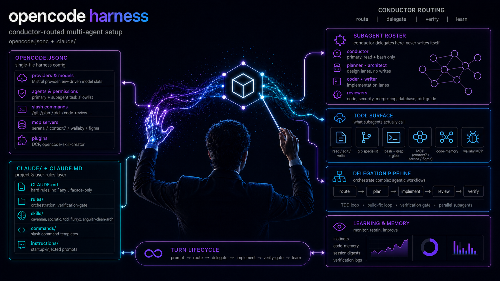

<p align="center">
  
</p>

<p align="center">
  <a href="https://github.com/fmflurry/code-memory"></a>
  <a href="LICENSE"></a>
  <a href="https://opencode.ai"></a>
  <a href="https://claude.com/claude-code"></a>
</p>

> ### Powered by [**CodeMemory**](https://github.com/fmflurry/code-memory)
>
> The semantic backbone of this harness. CodeMemory indexes the whole repo into a queryable memory of files, symbols, and episodes — so every agent walks into a session **already knowing the codebase** instead of grepping it back into existence on every turn.
>
> - **Orientation, not scanning.** One `code-memory_codememory_retrieve` call surfaces the right paths, symbols, and prior decisions; `grep`/`read` only run afterwards for exact verification.
> - **Cross-session memory.** Episodes and findings persist — agents pick up where the last session left off instead of re-discovering the repo from scratch.
> - **Wired in by default.** `instructions/codememory-first.md` is loaded at session start, and `code-memory_*` tools are pre-allowlisted for the conductor and every specialist subagent.

# OpenCode + Claude Code Setup

> My personal **OpenCode** and **Claude Code** configuration, kept public so I can sync it across machines — and so anyone curious can borrow what's useful. MIT licensed, fork freely. It evolves with my workflow, so treat it as a living reference rather than a stable distribution.

### Want to try it? Jump to **[Public install](#public-install)** — it takes about five minutes.

---

## What's inside

A hardened primary `conductor` agent backed by **20 specialist sub-agents** (planner, architect, coder, writer, code-reviewer, ecosystem-auditor, angular-cop, dotnet-cop, gdpr-specialist, security-reviewer, tdd-guide, build-error-resolver, e2e-runner, doc-updater, refactor-cleaner, database-reviewer, api-spec-architect, git-specialist, scout, learning-reviewer), wired together by:

- **Mandatory sub-agent delegation** from `conductor`: the primary has `write` and `edit` denied at the permission layer. The orchestrator cannot patch files — every change MUST go through `coder` (source code), `writer` (docs/markdown/HTML), `tdd-guide` (tests), or `git-specialist` (commits/PRs). This makes routing **model-agnostic**: even open-weight models that ignore prose rules are mechanically forced to delegate.
- **Front-loaded first-tool gate** in `prompts/agents/conductor.txt`: hard rules at the top, routing table second, six few-shot User → `task` examples (with explicit wrong-way contrasts) so literal models copy the right pattern.
- **Slash commands** that force routing to the right specialist (`/plan`, `/tdd`, `/security`, `/cop-review`, …).
- **Always-on docs** loaded at session start — subagent routing, question handling, [CodeMemory-first](https://github.com/fmflurry/code-memory) repo orientation, verification gate, harness parity, brief contract, and tool budget.
- **OpenCode plugins** — `.env` secret-file guard, desktop notifications, LLM metrics, a tool-budget nudge, Mistral cache affinity, CodeMemory nudges, and proposal-only local learning.
- **Custom tools** — `run-tests`, `check-coverage`, `security-audit`, plus a codemap generator.
- **A `.claude/` mirror** — hooks, rule packs, and skills, so Claude Code benefits from the same guardrails.

The two halves stand alone. Use the OpenCode side, the Claude Code mirror, or both — whichever you'd find useful.

## Table of contents

- [Public install](#public-install)
- [English](#english)
  - [Goals](#goals-en)
  - [Repository layout](#layout-en)
  - [Configuration](#config-en)
  - [Agents](#agents-en)
  - [Slash commands](#commands-en)
  - [Skills](#skills-en)
  - [Plugins & hooks](#plugins-en)
- [Custom tools](#tools-en)
- [Local learning operations](#learning-en)
  - [TUI plugins](#tui-en)
  - [Claude Code mirror](#claude-en)
  - [How it fits together](#flow-en)
- [Français](#francais)
  - [Objectif](#objectif-fr)
  - [Structure du repo](#structure-fr)
  - [Configuration](#config-fr)
  - [Agents](#agents-fr)
  - [Commandes slash](#commands-fr)
  - [Skills](#skills-fr)
  - [Plugins & hooks](#plugins-fr)
  - [Outils custom](#tools-fr)
  - [TUI plugins](#tui-fr)
  - [Mirror Claude Code](#claude-fr)
  - [Comment tout s'emboite](#flow-fr)

---

<a id="public-install"></a>

## Public install

The repo is designed to merge into `~/.config/opencode/`, plus an optional `~/.claude/` mirror. There are three paths: a **one-line install** (recommended — nothing to clone by hand), a one-shot script if you already have the repo, and a manual walk-through if you want to see every step.

### One-line install

You don't need to clone anything first. The bootstrap fetches the repo into `~/.local/share/settings-opencode` (override with `SETTINGS_OPENCODE_SRC`), then runs the installer. **Re-running the exact same command is also how you update** — it pulls the latest and re-applies it.

**macOS / Linux / WSL** (bash):

```bash
curl -fsSL https://raw.githubusercontent.com/fmflurry/settings-opencode/master/bootstrap.sh | bash
```

On WSL it installs to the **Windows** side (`/mnt/c/Users/<you>/.config/opencode`), matching `install.sh`'s WSL behaviour. Pass installer flags through after `-s --`:

```bash
curl -fsSL https://raw.githubusercontent.com/fmflurry/settings-opencode/master/bootstrap.sh | bash -s -- --local
curl -fsSL https://raw.githubusercontent.com/fmflurry/settings-opencode/master/bootstrap.sh | bash -s -- --no-claude
curl -fsSL https://raw.githubusercontent.com/fmflurry/settings-opencode/master/bootstrap.sh | bash -s -- --uninstall
```

**Native Windows** (PowerShell — no WSL):

```powershell
irm https://raw.githubusercontent.com/fmflurry/settings-opencode/master/bootstrap.ps1 | iex
```

Merges into `%USERPROFILE%\.config\opencode` and `\.claude`, runs `npm install` (or `bun install`), and writes the `OPENCODE_*` defaults as **persistent User environment variables**. Open a new terminal afterwards so they take effect. Variants:

```powershell
# project-scoped install
& ([scriptblock]::Create((irm https://raw.githubusercontent.com/fmflurry/settings-opencode/master/bootstrap.ps1))) -Local
# skip the Claude mirror
& ([scriptblock]::Create((irm https://raw.githubusercontent.com/fmflurry/settings-opencode/master/bootstrap.ps1))) -NoClaude
# skip OpenCode (install Claude only)
& ([scriptblock]::Create((irm https://raw.githubusercontent.com/fmflurry/settings-opencode/master/bootstrap.ps1))) -NoOpencode
# uninstall (removes the OPENCODE_* env vars; leaves copied config in place)
& ([scriptblock]::Create((irm https://raw.githubusercontent.com/fmflurry/settings-opencode/master/bootstrap.ps1))) -Uninstall
```

### Prerequisites

- macOS, Linux, WSL, or native Windows.
- [OpenCode CLI](https://opencode.ai) installed and on your `PATH` (unless installing Claude Code only via `--no-opencode`).
- [Claude Code](https://claude.com/claude-code) installed if you want the `.claude/` mirror (unless skipped via `--no-claude`).
- Either [Bun](https://bun.sh) (recommended — `bun.lock` is what's checked in) or Node.js **>=22.6** with `npm`.
- `git`.

### Secrets

This repo stores **no API keys**. If you use the `myMistral` provider in `opencode.jsonc`, set `MISTRAL_API_KEY` by:
- Copying `.env.example` → `.env` and filling in your key, OR
- Exporting `MISTRAL_API_KEY` in your shell rc.

Other providers (Anthropic, OpenAI, GitHub Copilot, OpenCode Go) need their own keys set the same way if you select their profiles. Both `.env` and `.env` variants are git-ignored; only `.env.example` is tracked.

### Quick install (script)

Already have the repo cloned? Run the installer directly:

```bash
git clone https://github.com/fmflurry/settings-opencode.git ~/Workspace/settings-opencode
cd ~/Workspace/settings-opencode
./install.sh
```

`install.sh` is interactive by default. It will prompt for each of two independent targets (OpenCode and Claude Code):

1. Verify your prerequisites (`git`, `bun`/`npm`).
2. **OpenCode** (if selected): merge repo files into `~/.config/opencode` (or `./.opencode` if `--local`) without removing existing user config.
3. Run `bun install` (or `npm ci` if Bun isn't available).
4. Sync skills from the canonical set into both harnesses via `scripts/sync-skills.sh`.
5. Seed personal config files (`settings.json`, `settings.local.json`, `policy-limits.json`) **only on first install**; preserve user edits on reinstall.
6. Add the `OPENCODE_MODEL_*` and `OPENCODE_REASONING_*` defaults to your shell rc, fenced with markers so re-runs and uninstalls are idempotent (OpenCode only, skipped if `--local`).
7. **Claude Code** (if selected): merge `.claude/` into `~/.claude` (or `./.claude` if `--local`).
8. Print a smoke-test command and the locations to tweak afterwards.

Useful flags:

| Flag            | Behaviour                                                                                                                                                                                   |
| --------------- | ------------------------------------------------------------------------------------------------------------------------------------------------------------------------------------------- |
| _(none)_        | Interactive walk-through: prompt `[Y/n]` for OpenCode (default Y) and Claude Code (default Y).                                                                                               |
| `--yes`, `-y`   | Non-interactive — accept all defaults: OpenCode ✓, Claude Code ✓. Existing normal directories are merged, not removed or backed up.                                                           |
| `--local`       | Project-scoped install into the current directory (`./.opencode`, `./.claude` as independent siblings); skips the global shell-rc env block (prints it as a hint instead).                   |
| `--opencode`    | **Allow-list:** install OpenCode only (if combined with other flags, only those are installed).                                                                                             |
| `--claude`      | **Allow-list:** install Claude Code only.                                                                                                                                                   |
| `--no-opencode` | **Deny:** skip OpenCode entirely (repo copy, deps, and env block). Can be combined with other targets.                                                                                      |
| `--no-claude`   | **Deny:** skip the Claude Code mirror. Can be combined with other targets.                                                                                                                  |
| `--uninstall`   | Remove the env-var block and optionally remove copied local/global dirs after confirmation. **Never deletes the cloned repo or your data without confirmation.**                               |
| `--help`, `-h`  | Print usage.                                                                                                                                                                                |

The script writes a fenced block to your shell rc (`~/.zshrc`, `~/.bashrc`, or `~/.config/fish/config.fish`) that looks like this:

```bash
# >>> settings-opencode >>>
# Added by settings-opencode installer. Edit values to match your provider.
export OPENCODE_MODEL_PRIMARY="anthropic/claude-sonnet-4-6"
export OPENCODE_MODEL_SUBAGENT_PLANNER="anthropic/claude-opus-4-7"
export OPENCODE_MODEL_SUBAGENT_WORKER="anthropic/claude-sonnet-4-6"
export OPENCODE_MODEL_SUBAGENT_MINI="anthropic/claude-haiku-4-5"
export OPENCODE_MODEL_LEARNING="ollama/qwen2.5-coder:7b-instruct"
export OPENCODE_REASONING_PRIMARY="high"
export OPENCODE_REASONING_SECONDARY="medium"
export OPENCODE_REASONING_TERTIARY="low"
# <<< settings-opencode <<<
```

Edit the values inside the markers to point at whichever provider you use. Re-running `./install.sh` rewrites the same block; `./install.sh --uninstall` removes it cleanly.

If your shell isn't bash/zsh/fish, the script prints the env block for you to paste manually and continues with the rest of the install.

### Manual install

<details>
<summary>Click to expand the step-by-step manual walk-through (same outcome as the script).</summary>

#### 1. Clone the repo, then merge it into the OpenCode config dir

OpenCode loads `~/.config/opencode/opencode.jsonc` at startup. Keep the repo wherever you like, then copy it additively into the config dir.

```bash
# Clone
git clone https://github.com/fmflurry/settings-opencode.git ~/Workspace/settings-opencode
mkdir -p ~/.config/opencode
rsync -a --exclude node_modules --exclude .git ~/Workspace/settings-opencode/ ~/.config/opencode/
cd ~/.config/opencode
```

#### 2. Install plugin/tool dependencies

```bash
bun install        # uses bun.lock
# or
npm ci
```

#### 3. Set the model + reasoning environment variables

The `agent` block in `opencode.jsonc` is parameterized via env vars so you can swap providers without editing the config. Add these to your shell profile (`~/.zshrc`, `~/.bashrc`, etc.):

```bash
# Required (OpenCode model identifiers — adjust to whatever provider you use)
export OPENCODE_MODEL_PRIMARY="anthropic/claude-sonnet-4-6"
export OPENCODE_MODEL_SUBAGENT_PLANNER="anthropic/claude-opus-4-7"
export OPENCODE_MODEL_SUBAGENT_WORKER="anthropic/claude-sonnet-4-6"
export OPENCODE_MODEL_SUBAGENT_MINI="anthropic/claude-haiku-4-5"
export OPENCODE_MODEL_LEARNING="ollama/qwen2.5-coder:7b-instruct"

# Reasoning effort tiers
export OPENCODE_REASONING_PRIMARY="high"
export OPENCODE_REASONING_SECONDARY="medium"
export OPENCODE_REASONING_TERTIARY="low"
```

If your provider doesn't support `reasoningEffort`, OpenCode silently ignores it — pick any value.

#### 4. Install MCP server prerequisites

`opencode.jsonc` declares six MCP servers: one enabled by default (`code-memory`) and five disabled (`context7`, `blender`, `wallaby`, `Figma`, `smartbear-swagger`). **CodeMemory is strongly recommended** — `instructions/codememory-first.md` routes repo orientation through it before falling back to `grep`/`read`. The others are optional but documented here so you know what you're opting into.

| Server            | Install                                                                                        | Status                                                                                                                                                   |
| ----------------- | ---------------------------------------------------------------------------------------------- | -------------------------------------------------------------------------------------------------------------------------------------------------------- |
| code-memory       | `uvx --from flurryx-code-memory@latest code-memory-mcp` (auto-installed on first use)          | **Recommended.** Enabled. Semantic repo orientation; `code-memory_*` tools are pre-allowlisted for every subagent. Pairs with `instructions/codememory-first.md`. |
| context7          | nothing — `npx -y @upstash/context7-mcp@latest`                                                | Disabled by default. Live docs lookup.                                                                                                                    |
| blender           | `uv --directory $HOME/dev/blender_mcp/mcp run blender-mcp`                                     | Disabled by default. Blender scene tooling.                                                                                                               |
| wallaby           | install [Wallaby.js](https://wallabyjs.com) and run `wallaby update-mcp`                       | Disabled by default. Runtime-test introspection.                                                                                                          |
| Figma             | remote — `https://mcp.figma.com/mcp`                                                           | Disabled by default. Flip `enabled: true` and set up [Figma MCP](https://help.figma.com) for design-system tools.                                          |
| smartbear-swagger | remote — `https://swagger.mcp.smartbear.com/mcp`                                               | Disabled by default. OpenAPI/Swagger tooling for `api-spec-architect`.                                                                                    |

#### 5. (Optional) Install the Claude Code mirror

The repo ships a `.claude/` subtree. OpenCode and Claude Code can be installed separately and never nest inside one another.

**Claude Code:**

```bash
mkdir -p ~/.claude
rsync -a ~/.config/opencode/.claude/ ~/.claude/
```

What this installs:

- `.claude/CLAUDE.md` — global user instructions Claude Code reads on every session.
- `.claude/settings.json` — permissions, hooks, env vars (`API_TIMEOUT_MS`, autocompact threshold, etc.). Seeded on first install only; user edits preserved on reinstall.
- `.claude/hooks/*.sh` — pre-tool-use security warnings + stop hook.
- `.claude/rules/{common,typescript}/*.md` — coding-style/testing/security rule packs.
- `.claude/commands/*.md` — extra slash commands (`/create-pull-request`, `/update-codemaps`).
- `.claude/skills/**` — **full parity copy of canonical skill set** (same as `skills/` at repo root, computed and synced by `scripts/sync-skills.sh`). Includes all OpenCode skills; both sides stay in sync.

</details>

### Smoke test

```bash
opencode
```

You should see:

- The `llm-metrics` TUI sidebar and the panda banner show up.

Then drop a slash command:

```
/plan add a TODO list to my homepage
```

It should route to the `planner` sub-agent and return a structured plan without writing code.

### Model profile picker (`ocp`)

`ocp` (alias for `opencode-pick`) launches OpenCode with a chosen model/reasoning profile. The canonical profiles are the `OPENCODE_MODEL_*` / `OPENCODE_REASONING_*` export blocks in `bin/opencode-models.zsh`, adjacent to `bin/opencode-pick`. By default, the installer deploys both files to `~/.config/opencode/bin/`. Local installs use `./.opencode/bin/`; WSL global installs target `/mnt/c/Users/<you>/.config/opencode/bin/` on the Windows side.

**Usage:**

```bash
ocp                          # Interactive picker (fzf if installed, else numbered menu)
ocp --list                   # List available profiles
ocp --profile "<name>"       # Launch with a named profile
ocp -- <args>                # Forward args to opencode
```

`reasoningEffort` controls the provider request option. `variant` is OpenCode's TUI-visible per-model reasoning state. A profile launch sets both to the same non-empty effort for each configured agent and synchronizes the conductor model's `variant` in `${XDG_STATE_HOME:-$HOME/.local/state}/opencode/model.json`.

Verify a profile without making a billable model request:

```bash
ocp --profile "<name>" -- debug agent conductor
```

The conductor output should show matching `variant` and `reasoningEffort` values. Relaunch OpenCode through `ocp` after changing profiles so the selected profile resets the current TUI state.

At launch, the picker preserves the ambient environment and injects per-agent settings through an `OPENCODE_CONFIG_CONTENT` overlay. Launcher diagnostics print only an explicit allowlist of model and reasoning variables; they never print `OPENCODE_CONFIG_CONTENT` or secret/token variables. **Bash-based, macOS/Linux/WSL only** (native Windows uses static `OPENCODE_*` env vars written by `bootstrap.ps1`).

### Updating

If you installed via the one-liner, **re-run the exact same command** — it pulls the latest and re-applies it:

```bash
# macOS / Linux / WSL
curl -fsSL https://raw.githubusercontent.com/fmflurry/settings-opencode/master/bootstrap.sh | bash
```

```powershell
# native Windows
irm https://raw.githubusercontent.com/fmflurry/settings-opencode/master/bootstrap.ps1 | iex
```

If you cloned the repo by hand instead:

```bash
cd ~/.config/opencode
git pull
./install.sh --yes        # refreshes deps + env block; idempotent
# or, if you want to do it by hand:
# bun install   (or: npm ci)
```

If a new plugin shows up, OpenCode picks it up on the next restart. If an env var is added to `opencode.jsonc`, this README will mention it.

---

<a id="english"></a>

## English

Dotfiles for OpenCode + the stable parts of `~/.claude`. Ships a hardened primary `conductor` agent (no write/edit perms — must delegate), **20 specialist sub-agents**, always-on skills, slash commands, OpenCode plugins (secret-file guard, notifications, llm-metrics, tool-budget), custom tools, and a Claude Code mirror.

<a id="goals-en"></a>

### Goals

- Reproducibility: same agent behavior across machines/sessions.
- Quality: on-demand TDD, frequent verification, centralized conventions.
- Security: `security-review` skill available on demand + pre-tool-use hooks.

<a id="layout-en"></a>

### Repository layout

- Configs: `opencode.jsonc`, `dcp.jsonc` (dynamic context pruning), `tui.json` (TUI theme).
- Profiles: `profiles/<name>/` (per-profile overrides + `AGENTS.md`).
- Skills: `skills/*/SKILL.md` (plus auxiliary docs) — **canonical set, shared with Claude Code via** `sync-skills.sh`.
- Agent prompts: `prompts/agents/*.txt`.
- Slash commands: `commands/*.md`.
- OpenCode plugins: `plugins/*.{ts,js}` + `plugins/kdco-primitives/` + `plugins/llm-metrics-lib/`.
- TUI plugins: `tui-plugins/*.tsx`.
- Custom tools: `tools/*.ts`.
- Mode notes: `contexts/*.md`.
- Global instructions: `instructions/subagent-routing.md`, `instructions/codememory-first.md`, `instructions/caveman-ultra.md`.
- Scripts: `scripts/setup-package-manager.js`, `scripts/codemaps/generate.ts`, `scripts/llm-metrics-dashboard.ts` (live llm-metrics dashboard), `scripts/sync-skills.sh` (sync canonical skill set to both harnesses).
- Claude mirror: `.claude/CLAUDE.md`, `.claude/settings.json`, `.claude/hooks/`, `.claude/rules/`, `.claude/skills/` (full parity copy), `.claude/commands/`.
- Intentional exclusions (`.gitignore`): `node_modules/`, `antigravity-*`, `.DS_Store`, local `.env*` files except `.env.example`, runtime dir `skills/skill-creator/` (not synced).

<a id="config-en"></a>

### Configuration: `opencode.jsonc`

Six concerns wired in one file:

1. `instructions`: always-on docs loaded at session start. Currently:
   - `instructions/subagent-routing.md` — Task-first subagent delegation gate.
   - `instructions/question-handling.md` — blocking vs non-blocking question protocol.
   - `instructions/codememory-first.md` — prefer [CodeMemory](https://github.com/fmflurry/code-memory) MCP (`code-memory_*` tools) for repo orientation before `grep`/`read`.
   - `instructions/verification-gate.md` — independent build/test verification before "done".
   - `instructions/harness-parity.md` — keep `.claude/` and `.opencode/` in parity.
   - `instructions/brief-contract.md` — subagent brief contract.
   - `instructions/tool-budget.md` — verification-vs-exploration budget.
2. `default_agent`: `conductor` (orchestrator-only — cannot write/edit).
3. `agent`: sub-agent definitions (model + reasoning effort + prompt + tool allowlist). All models are env-driven (`OPENCODE_MODEL_*`, `OPENCODE_REASONING_*`) — see [Public install § 4](#public-install).
4. `command`: maps `/<name>` -> template + sub-agent + `subtask`.
5. `mcp`: six servers — `code-memory` enabled; `context7`, `blender`, `wallaby`, `Figma`, `smartbear-swagger` disabled by default. `code-memory_*` perms are pre-allowlisted for every subagent.
6. `plugin`: npm + local plugins — `opencode-skill-creator` (npm) plus the `./plugins/*.{ts,js}` files (which OpenCode also auto-loads from the plugin directory).

`dcp.jsonc` is the config stub for the optional external Dynamic Context Pruning plugin.

<a id="agents-en"></a>

### Agents

Defined in `opencode.jsonc` under `agent`:

| Agent                  | Mode     | Role                                                                                                                                                                              |
| ---------------------- | -------- | --------------------------------------------------------------------------------------------------------------------------------------------------------------------------------- |
| `conductor`            | primary  | Orchestrator. `write` + `edit` **denied** at the permission layer. Routes every change to a specialist via Task. |
| `planner`              | subagent | Plan + risks before large changes. Read+bash, no edit.                                                                                                                            |
| `architect`            | subagent | System design / scalability decisions. Read+bash only.                                                                                                                            |
| `coder`                | subagent | Pure non-test implementation. Mandatory build+lint+standards self-check before reporting done. Socratic ambiguity gate.                                                           |
| `writer`               | subagent | Writes docs/markdown/HTML/text artifacts. Forbidden from touching source code — refuses out-of-scope files back to the conductor.                                                 |
| `code-reviewer`        | subagent | Quality review over diffs and conventions. Read-only — findings only; fixes go to `coder`.                                                                                        |
| `ecosystem-auditor`    | subagent | Read-only, evidence-first audit across OpenCode and Claude Code.                                                                                                                  |
| `angular-cop`          | subagent | Pre-merge review for Angular + TypeScript PRs.                                                                                                                                     |
| `dotnet-cop`           | subagent | Pre-merge review for .NET / Minimal API / modular-monolith PRs.                                                                                                                     |
| `gdpr-specialist`      | subagent | GDPR/CNIL compliance review of code (France-focused).                                                                                                                              |
| `security-reviewer`    | subagent | OWASP/secrets/deps review. Read-only — reports vulnerabilities; remediation routed to `coder`.                                                                                    |
| `tdd-guide`            | subagent | RED -> GREEN -> REFACTOR + 80% coverage. Writes tests; delegates GREEN impl to `coder` via scoped Task perm.                                                                      |
| `build-error-resolver` | subagent | Build/TS error fixes with minimal diffs.                                                                                                                                          |
| `e2e-runner`           | subagent | Playwright E2E tests.                                                                                                                                                             |
| `doc-updater`          | subagent | Generated docs + codemaps.                                                                                                                                                        |
| `refactor-cleaner`     | subagent | Dead-code removal + consolidation.                                                                                                                                                |
| `database-reviewer`    | subagent | PostgreSQL / Supabase schema, perf, security.                                                                                                                                     |
| `api-spec-architect`   | subagent | OpenAPI / API specification design.                                                                                                                                               |
| `git-specialist`       | subagent | Branches, commits, pushes, PRs (mini model).                                                                                                                                      |
| `scout`                | subagent | Emits a file manifest for an unknown file set.                                                                                                                                    |
| `learning-reviewer`    | subagent | Local proposal-only learning reviewer. Extracts durable learnings non-interactively.                                                                                              |

### Hardened sub-agent orchestration

Delegation is enforced at **two layers**, so the same behavior holds whether the primary model is Claude, GPT, DeepSeek, or any open-weight runner that ignores prose hints:

1. **Permissions** — `conductor` has `tools.write: false`, `tools.edit: false`, and `permission.edit/write: deny` in `opencode.jsonc`. The Task allowlist enumerates every legal specialist; `*: deny` blocks anything else. The orchestrator literally has no file-mutation tool.
2. **Guard plugins + front-loaded prompt** — `plugins/secret-file-guard.ts` aborts any `read`/`bash` access to a secret-bearing `.env` file; `plugins/tool-budget.ts` nudges verification over exploration (it never blocks a call). `prompts/agents/conductor.txt` puts hard rules in the first lines, the routing table second, and six worked few-shot examples showing User → `task` calls with explicit wrong-way contrasts; `instructions/subagent-routing.md` enforces a Task-first gate before direct inspection.

Use these paths depending on how much control you want:

- Plain request: `conductor` consults the routing table and dispatches the matching specialist via Task.
- `@agent` mention: manually invokes a specific subagent in the conversation.
- Slash command: forces a subtask with a configured template, e.g. `/plan`, `/tdd`, `/security`.

Why this exists: GPT/Claude often infer delegation from short descriptions, but open-source/open-weight models are more literal and tend to inspect or edit first. Permissions + the front-loaded gate make delegation **mechanically enforced** rather than instruction-dependent.

<a id="commands-en"></a>

### Slash commands

Templates in `commands/`. Most run as `subtask: true` (delegated to a specialist).

| Command            | Sub-agent            | Purpose                              |
| ------------------ | -------------------- | ------------------------------------ |
| `/git`             | git-specialist       | Bounded git ops (branches, commits). |
| `/push-changes`    | git-specialist       | Commit + push with upstream guard.   |
| `/plan`            | planner              | Implementation plan.                 |
| `/tdd`             | tdd-guide            | TDD cycle with coverage.             |
| `/cop-review`      | code-reviewer        | Direct pre-merge review; selects stack guidance. |
| `/security`        | security-reviewer    | Security audit.                      |
| `/build-fix`       | build-error-resolver | Build/TS error resolution.           |
| `/e2e`             | e2e-runner           | E2E test generation/run.             |
| `/refactor-clean`  | refactor-cleaner     | Dead-code cleanup.                   |
| `/orchestrate`     | planner              | Multi-agent orchestration.           |
| `/update-docs`     | doc-updater          | Doc updates.                         |
| `/update-codemaps` | doc-updater          | Generates `docs/CODEMAPS/`.          |
| `/test-coverage`   | tdd-guide            | Coverage analysis.                   |
| `/verify`          | (primary)            | Verification loop.                   |
| `/eval`            | (primary)            | Evaluate against criteria.           |
| `/skill-create`    | (primary)            | Generate a skill from git history.   |

<a id="skills-en"></a>

### Skills

**All skills are kept at full parity across OpenCode (`skills/`) and Claude Code (`.claude/skills/`) via the canonical union computed and synced by `scripts/sync-skills.sh`.** Both `skills/` (root, source of truth) and `.claude/skills/` (mirror) are self-contained; a raw `cp -R .claude ~/.claude` yields a complete skill set.

Session-start context comes from `instructions/*.md` (see [Configuration](#config-en)); these skills load on demand:

- `skills/socratic-design/SKILL.md` — evidence-first decision gating.
- `skills/security-review/SKILL.md` — security checklist + scenarios.
- `skills/coding-standards/SKILL.md` — naming, immutability, file size, error handling.
- `skills/git-workflow/SKILL.md` — branches, conventional commits, push guards.

On-demand (loaded by description / by command):

- `skills/tdd-workflow/SKILL.md` — full TDD methodology.
- `skills/caveman/SKILL.md`, `caveman-commit`, `caveman-review` — terse mode.
- `skills/strategic-compact/SKILL.md` — manual compaction at logical breakpoints.
- `skills/dotnet-clean-architecture/SKILL.md` (+ playbooks) — .NET 10 BFF scaffolding.
- `skills/angular-clean-architecture/SKILL.md` (+ store, migration, testing) — Angular 18 standalone scaffolding.
- `skills/angular-cop/SKILL.md` — Angular + TS pre-merge review rules.
- `skills/dotnet-cop/SKILL.md` — .NET pre-merge review rules.
- `skills/angular-accessibility/SKILL.md` — Angular ARIA audit.
- `skills/compress/SKILL.md` — context compression.
- `skills/flurryx/SKILL.md` — domain-specific patterns.
- `skills/transloco/SKILL.md` — Transloco i18n management.

**Sync behavior:** `scripts/sync-skills.sh` computes the canonical union (root `skills/` ∪ `.claude/skills/`, root wins on conflicts), excludes runtime dir (`skills/skill-creator/`), and copies into the given destination(s). Runs standalone and is invoked by installers.

<a id="plugins-en"></a>

### Plugins & hooks

All TypeScript plugins use `@opencode-ai/plugin@1.4.6`. OpenCode auto-loads every `.ts`/`.js` file in `plugins/`; the `plugin` array in `opencode.jsonc` additionally declares the npm plugin and re-references the local files.

- `plugins/secret-file-guard.ts` — hard-blocks `read`/`bash` access to secret-bearing `.env` files; `.env.example`/`.sample`/`.template` stay readable.
- `plugins/notification.ts` — desktop notifications on session completion and question/permission events; optional Bark/iPhone push.
- `plugins/mistral-affinity.js` — attaches a stable `x-affinity` header to Mistral / Mistral-compatible provider calls for cache affinity.
- `plugins/tool-budget.ts` — nudges the model toward verification over exploration via the system prompt (never blocks a tool call).
- `plugins/code-memory.ts` — CodeMemory auto-retrieve / auto-learn nudges (no-op when the `code-memory` CLI is absent).
- `plugins/llm-metrics.ts` + `plugins/llm-metrics-lib/` — real-time LLM-behavior monitor: hooks bus events into per-call metrics (tokens, TTFT, duration, cost, model, finish reason, end-to-end + generation tok/s) appended as NDJSONL to `~/data/llm-metrics.jsonl`, backed by a shared pure core (110 unit tests). Local-only, no egress; response-text capture is bounded and opt-out. Full architecture, env knobs, tok/s definitions, subagent aggregation, and privacy boundary in [`LLM_METRICS.md`](LLM_METRICS.md).
- `plugins/kdco-primitives/` — shared utilities (mutex, shell, terminal-detect, project-id resolver, types).
- `plugins/learning-runtime.ts` + `plugins/learning/` — proposal-only local learning for one local OS profile's own conversations. It starts disabled and requires explicit profile acknowledgement. Allowlisted, sanitized high-signal descriptors reach a locally launched reviewer only through the supported POSIX (macOS/Linux) artifact-validation path; native Windows fails closed. The runtime validates the executable and separately verified model artifact and supplies the latter through a fixed `--model-artifact` argument; raw prompts, transcripts, tool output, and PII do not reach the reviewer. Artifact validation does not by itself prove that a reviewer cannot log or forward descriptors. It is capped at two proposals per session and ten per day, supports retention/purge/deletion/export/audit, and has immediate cross-process revoke. Accept/reject only changes proposal state: no claim assertion or automatic materialization. Canonical OpenCode/Claude sync, organizational governance, machine-readable CLI output, and the complete boundary are in [`LEARNING.md`](LEARNING.md).
- `opencode-skill-creator` _(external npm, declared in `opencode.jsonc › plugin`)_ — skill scaffolding and benchmarking.
- _Not loaded:_ `plugins/ecc-hooks.ts.disabled` and `tui-plugins/caveman.tsx.disabled` ship disabled and are skipped by the loader.

<a id="tools-en"></a>

### Custom tools (`tools/`)

Reusable OpenCode tools exposed via `tools/index.ts`:

- `tools/run-tests.ts` — detects package manager + framework and builds the test command.
- `tools/check-coverage.ts` — reads coverage reports and compares against a threshold.
- `tools/security-audit.ts` — scans deps + secrets + risky patterns.

<a id="learning-en"></a>

### Local learning operations

Local learning is advisory and proposal-only. The local `bin/proposal-learning` wrapper is the
only queue control plane for both OpenCode and Claude; neither exposes learning slash commands,
a learning agent, state tool, or proposal content to an LLM. It starts disabled and requires the
versioned acknowledgement and profile metadata documented in [`LEARNING.md`](LEARNING.md).
Accept/reject changes state only: an accepted proposal still requires normal human-authored,
reviewed PR/change material. The full privacy, local-model, retention, scheduler, deployment,
and CLI contract is in [`LEARNING.md`](LEARNING.md).

<a id="tui-en"></a>

### TUI plugins

- `tui-plugins/llm-metrics.tsx` — SolidJS sidebar (in the `sidebar_content` slot) showing live per-session LLM metrics: a streaming `~tok/s (est)`, latest-call generation/e2e tok/s, tokens in/out, model, cost, finish reason, TTFT, and a rolling-average tok/s. Aggregates the whole subagent subtree. See [`LLM_METRICS.md`](LLM_METRICS.md).
- `tui-plugins/panda-banner.tsx` — SolidJS banner that renders a panda ASCII/block-art header.

<a id="claude-en"></a>

### Claude Code mirror (`.claude/`)

- `CLAUDE.md` — global user instructions (no `any`, facade != UseCase).
- `settings.json` — allow/deny permissions, env (`API_TIMEOUT_MS=3000000`, `CLAUDE_CODE_DISABLE_NONESSENTIAL_TRAFFIC=1`, `CLAUDE_AUTOCOMPACT_PCT_OVERRIDE=80`), `PreToolUse` / `PostToolUse` / `Stop` hooks. Seeded on first install; personal edits preserved on reinstall.
- `hooks/pre-tool-use.sh` — warning-only checks on sensitive commands/files.
- `hooks/stop.sh` — Claude Code stop hook.
- `rules/common/*.md` + `rules/typescript/*.md` — rule packs (style, testing, security, patterns, hooks, agents).
- `commands/{create-pull-request,update-codemaps}.md` — Claude commands.
- `skills/**` — **full parity copy of canonical skill set** (synced via `scripts/sync-skills.sh`). Both OpenCode and Claude Code see the same skills; updates to root `skills/` propagate to `.claude/skills/` on install/sync.

<a id="flow-en"></a>

### How it fits together

1. Startup: OpenCode loads `opencode.jsonc` -> always-on instructions -> auto-loads every plugin in `plugins/` plus the TUI plugins registered in `tui.json`.
2. Dev: `conductor` executes — it cannot write files; it dispatches Task calls to specialists. `secret-file-guard` blocks `.env` access; `tool-budget` nudges verification over exploration.
3. Workflow: `conductor` routes to specialists through Task (perm-enforced); `/plan`, `/tdd`, `/security`, etc. force the same routing explicitly.
4. Idle/completion: `llm-metrics` persists per-call metrics; `notification` sends completion/question/permission alerts; `learning-runtime` reviews high-signal sessions when enabled.

---

<a id="francais"></a>

## Français

Depot "dotfiles" pour OpenCode + la partie stable de `~/.claude`. Embarque un agent principal `conductor` durci (write/edit interdits, delegation obligatoire), **vingt sous-agents specialises**, des instructions toujours actives, des commandes slash, des plugins (secret-file guard, notifications, llm-metrics, tool-budget, apprentissage local par propositions), des outils custom et un mirror Claude Code.

<a id="objectif-fr"></a>

### Objectif

- Reproductibilite: meme comportement entre machines/sessions.
- Qualite: TDD a la demande, verification reguliere, conventions centralisees.
- Securite: skill `security-review` disponible à la demande + hooks pre-tool-use (security warnings).

- Configs: `opencode.jsonc`, `dcp.jsonc` (dynamic context pruning), `tui.json` (theme TUI).
- Profils: `profiles/<name>/` (override `opencode.jsonc` + `AGENTS.md` par profil).
- Skills: `skills/*/SKILL.md` (+ ressources auxiliaires) — **ensemble canonical, partage avec Claude Code via `sync-skills.sh`**.
- Prompts agents: `prompts/agents/*.txt`.
- Commandes slash: `commands/*.md`.
- Plugins OpenCode: `plugins/*.{ts,js}` (+ `plugins/kdco-primitives/` + `plugins/llm-metrics-lib/`).
- TUI plugins: `tui-plugins/*.tsx` (sidebar React rendue par OpenCode).
- Outils custom: `tools/*.ts`.
- Contextes (memos de mode): `contexts/*.md`.
- Instructions globales: `instructions/subagent-routing.md`, `instructions/codememory-first.md`, `instructions/caveman-ultra.md`.
- Scripts: `scripts/setup-package-manager.js`, `scripts/codemaps/generate.ts`, `scripts/llm-metrics-dashboard.ts` (dashboard llm-metrics live), `scripts/sync-skills.sh` (synchronise l'ensemble canonical des skills aux deux harnesses).
- Mirror Claude Code: `.claude/CLAUDE.md`, `.claude/settings.json`, `.claude/hooks/`, `.claude/rules/`, `.claude/skills/` (copie en parité complète), `.claude/commands/`.
- Exclusions volontaires (`.gitignore`): `node_modules/`, `antigravity-*`, `.DS_Store`, fichiers locaux `.env*` sauf `.env.example`, répertoire runtime `skills/skill-creator/` (non synchronisé).

<a id="config-fr"></a>

### Configuration: `opencode.jsonc`

Le fichier orchestre six choses:

1. `instructions`: docs toujours chargees au demarrage. Aujourd'hui:
   - `instructions/subagent-routing.md` -> gate Task-first pour delegation sous-agent.
   - `instructions/question-handling.md` -> protocole questions bloquantes / non bloquantes.
   - `instructions/codememory-first.md` -> prefere [CodeMemory](https://github.com/fmflurry/code-memory) MCP (outils `code-memory_*`) pour l'orientation repo avant `grep`/`read`.
   - `instructions/verification-gate.md` -> verification build/test independante avant "done".
   - `instructions/harness-parity.md` -> garder `.claude/` et `.opencode/` en parité.
   - `instructions/brief-contract.md` -> contrat de brief des sous-agents.
   - `instructions/tool-budget.md` -> budget verification-vs-exploration.
2. `default_agent`: `conductor` (orchestrateur sans droit d'ecriture).
3. `agent`: definitions des sous-agents (modele + reasoning effort + prompt + outils autorises). Tous les modeles passent par variables d'environnement (`OPENCODE_MODEL_*`, `OPENCODE_REASONING_*`).
4. `command`: mappe `/<name>` -> template + sous-agent + `subtask` (delegation).
5. `mcp`: six serveurs — `code-memory` actif; `context7`, `blender`, `wallaby`, `Figma`, `smartbear-swagger` desactives par defaut. Perms `code-memory_*` pre-allowlistees pour chaque sous-agent.
6. `plugin`: plugins npm + locaux — `opencode-skill-creator` (npm) plus les fichiers `./plugins/*.{ts,js}` (qu'OpenCode auto-charge aussi depuis le repertoire de plugins).

`dcp.jsonc` est le stub de config du plugin externe optionnel Dynamic Context Pruning.

<a id="agents-fr"></a>

### Agents

Definis dans `opencode.jsonc` (champ `agent`):

| Agent                  | Mode     | Role                                                                                                                                                                             |
| ---------------------- | -------- | -------------------------------------------------------------------------------------------------------------------------------------------------------------------------------- |
| `conductor`            | primary  | Orchestrateur. `write` + `edit` **interdits** par permission. Route chaque modif via Task vers un specialiste. |
| `planner`              | subagent | Plan + risques avant grosse modif. Read+bash, pas d'edit.                                                                                                                        |
| `architect`            | subagent | Decisions de design / scalabilite. Read+bash uniquement.                                                                                                                         |
| `coder`                | subagent | Implementation pure (hors tests). Verification build+lint+standards obligatoire avant de rendre. Gate socratique en cas d'ambiguite.                                             |
| `writer`               | subagent | Ecrit docs/markdown/HTML/texte. Interdit de toucher au code source — refuse les fichiers hors scope au conductor.                                                                |
| `code-reviewer`        | subagent | Revue qualite (diff, conventions, tests). Read-only — findings seulement; les fixes passent par `coder`.                                                                         |
| `ecosystem-auditor`    | subagent | Audit read-only, evidence-first sur OpenCode et Claude Code.                                                                                                                     |
| `angular-cop`          | subagent | Revue pre-merge pour Angular + TypeScript PRs.                                                                                                                                   |
| `dotnet-cop`           | subagent | Revue pre-merge pour .NET / Minimal API / modular-monolith PRs.                                                                                                                   |
| `gdpr-specialist`      | subagent | Revue conformite GDPR/CNIL du code (focus France).                                                                                                                               |
| `security-reviewer`    | subagent | Revue OWASP/secrets/deps. Read-only — rapporte les vulnerabilites; remediation routee vers `coder`.                                                                              |
| `tdd-guide`            | subagent | RED -> GREEN -> REFACTOR + 80% coverage. Ecrit les tests; delegue le GREEN au `coder` via permission Task ciblee.                                                                |
| `build-error-resolver` | subagent | Fix build/TS errors avec diff minimal.                                                                                                                                           |
| `e2e-runner`           | subagent | Tests E2E Playwright.                                                                                                                                                            |
| `doc-updater`          | subagent | Codemaps + docs generees.                                                                                                                                                        |
| `refactor-cleaner`     | subagent | Suppression code mort + consolidation.                                                                                                                                           |
| `database-reviewer`    | subagent | PostgreSQL / Supabase: schema, perfs, securite.                                                                                                                                  |
| `api-spec-architect`   | subagent | Design OpenAPI / specification API.                                                                                                                                              |
| `git-specialist`       | subagent | Branches, commits, push, PRs (modele mini).                                                                                                                                      |
| `scout`                | subagent | Emet un manifeste de fichiers pour un ensemble inconnu.                                                                                                                          |
| `learning-reviewer`    | subagent | Revue d'apprentissage locale par propositions. Extrait les connaissances durables de maniere non-interactive.                                                                     |

### Orchestration durcie des sous-agents

La delegation est imposee sur **deux couches**, donc le comportement reste identique que le primary soit Claude, GPT, DeepSeek ou un modele open-weight qui ignore les instructions en prose:

1. **Permissions** — `conductor` a `tools.write: false`, `tools.edit: false`, et `permission.edit/write: deny` dans `opencode.jsonc`. L'allowlist Task enumere chaque specialiste legal; `*: deny` bloque le reste. L'orchestrateur n'a litteralement aucun outil pour modifier des fichiers.
2. **Guard plugins + prompt front-loaded** — `plugins/secret-file-guard.ts` avorte tout acces `read`/`bash` a un fichier `.env` porteur de secret; `plugins/tool-budget.ts` pousse la verification plutot que l'exploration (ne bloque jamais un appel). `prompts/agents/conductor.txt` place les regles dures dans les premieres lignes, la table de routage en second, et six exemples few-shot User -> `task` avec contre-exemples explicites; `instructions/subagent-routing.md` impose un Task-first gate avant inspection directe.

Chemins possibles:

- Requete normale: `conductor` consulte la table de routage et delegue via Task.
- Mention `@agent`: invoque manuellement un sous-agent precis.
- Commande slash: force un subtask avec template configure, par ex. `/plan`, `/tdd`, `/security`.

Pourquoi: GPT/Claude inferent souvent la delegation depuis des descriptions courtes, mais les modeles open-source/open-weight sont plus litteraux et inspectent ou editent souvent avant de deleguer. Permissions + gate front-loaded rendent la delegation **mecaniquement imposee** plutot que dependante de l'instruction.

<a id="commands-fr"></a>

### Commandes slash

Templates dans `commands/`. La plupart sont `subtask: true` -> elles s'executent dans un sous-agent isolé.

| Commande           | Sous-agent           | But                                        |
| ------------------ | -------------------- | ------------------------------------------ |
| `/git`             | git-specialist       | Operations git encadrees (branche/commit). |
| `/push-changes`    | git-specialist       | Commit + push (avec garde sur upstream).   |
| `/plan`            | planner              | Plan d'implementation.                     |
| `/tdd`             | tdd-guide            | Cycle TDD avec coverage.                   |
| `/cop-review`      | code-reviewer        | Revue pre-merge directe; selectionne le guide du stack. |
| `/security`        | security-reviewer    | Audit securite.                            |
| `/build-fix`       | build-error-resolver | Resolution build/TS errors.                |
| `/e2e`             | e2e-runner           | Generation/run tests E2E.                  |
| `/refactor-clean`  | refactor-cleaner     | Nettoyage code mort.                       |
| `/orchestrate`     | planner              | Orchestration multi-agents.                |
| `/update-docs`     | doc-updater          | Mise a jour de la doc.                     |
| `/update-codemaps` | doc-updater          | Genere `docs/CODEMAPS/`.                   |
| `/test-coverage`   | tdd-guide            | Analyse coverage.                          |
| `/verify`          | (primary)            | Boucle de verification.                    |
| `/eval`            | (primary)            | Evaluation contre criteres.                |
| `/skill-create`    | (primary)            | Genere une skill depuis l'historique git.  |

<a id="skills-fr"></a>

### Skills

**Tous les skills sont en parité complète entre OpenCode (`skills/`) et Claude Code (`.claude/skills/`) via l'union canonique calculée et synchronisée par `scripts/sync-skills.sh`.** Les deux `skills/` (root, source de vérité) et `.claude/skills/` (miroir) sont auto-contenus; une simple `cp -R .claude ~/.claude` donne l'ensemble complet des skills.

Le contexte de démarrage vient de `instructions/*.md` (voir [Configuration](#config-fr)); ces skills se chargent à la demande:

- `skills/socratic-design/SKILL.md` — decision-gating "evidence-first".
- `skills/security-review/SKILL.md` — checklist sécurité + scenarios.
- `skills/coding-standards/SKILL.md` — naming, immutabilité, taille fichier, error handling.
- `skills/git-workflow/SKILL.md` — branches, conventional commits, garde-fous push.

Skills sur demande (chargés par description / par commande):

- `skills/tdd-workflow/SKILL.md` — méthode TDD détaillée.
- `skills/caveman/SKILL.md`, `caveman-commit`, `caveman-review` — mode terse.
- `skills/strategic-compact/SKILL.md` — compaction manuelle aux paliers logiques.
- `skills/dotnet-clean-architecture/SKILL.md` (+ playbooks) — scaffold .NET 10 BFF.
- `skills/angular-clean-architecture/SKILL.md` (+ store, migration, tests) — scaffold Angular 18 standalone.
- `skills/angular-cop/SKILL.md` — règles pre-merge Angular + TS.
- `skills/dotnet-cop/SKILL.md` — règles pre-merge .NET.
- `skills/angular-accessibility/SKILL.md` — audit ARIA Angular.
- `skills/compress/SKILL.md` — compression de contexte.
- `skills/flurryx/SKILL.md` — patterns spécifiques au domaine.
- `skills/transloco/SKILL.md` — gestion i18n Transloco.

**Comportement sync:** `scripts/sync-skills.sh` calcule l'union canonique (root `skills/` ∪ `.claude/skills/`, root gagne en cas de conflit), exclut le répertoire runtime (`skills/skill-creator/`), et copie dans la(les) destination(s) donnée(s). S'exécute seul et est invoqué par les installateurs.

<a id="plugins-fr"></a>

### Plugins & hooks

Tous les plugins TypeScript utilisent `@opencode-ai/plugin@1.4.6`. OpenCode auto-charge chaque fichier `.ts`/`.js` de `plugins/`; le tableau `plugin` de `opencode.jsonc` declare en plus le plugin npm et re-reference les fichiers locaux.

- `plugins/secret-file-guard.ts` — bloque en dur l'acces `read`/`bash` aux fichiers `.env` porteurs de secret; `.env.example`/`.sample`/`.template` restent lisibles.
- `plugins/notification.ts` — notifications desktop sur fin de session et evenements question/permission; push Bark/iPhone optionnel.
- `plugins/mistral-affinity.js` — ajoute un header `x-affinity` stable aux appels Mistral / compatibles Mistral pour l'affinite de cache.
- `plugins/tool-budget.ts` — pousse le modele vers la verification plutot que l'exploration via le system prompt (ne bloque jamais un appel d'outil).
- `plugins/code-memory.ts` — nudges auto-retrieve / auto-learn CodeMemory (no-op si le CLI `code-memory` est absent).
- `plugins/learning-runtime.ts` + `plugins/learning/` — apprentissage local par propositions limite aux conversations propres a un profil OS local. Desactive par defaut, il exige un acquittement explicite. Seuls des descripteurs structures, nettoyes et a fort signal atteignent un executable offline de revue verifie, controle par le proprietaire, avec un artefact de modele verifie separement et passe par l'argument fixe `--model-artifact` ; jamais prompts bruts, transcripts, sorties d'outils ou PII. Limites : deux propositions par session et dix par jour ; retention/purge/suppression/export/audit et revocation inter-processus immediate. Accept/reject ne change que l'etat : aucune assertion de claim ni materialisation automatique. Voir [`LEARNING.md`](LEARNING.md).
- `plugins/llm-metrics.ts` + `plugins/llm-metrics-lib/` — moniteur temps reel du comportement LLM : accroche les evenements du bus en metriques par appel (tokens, TTFT, duree, cout, modele, finish reason, tok/s end-to-end + generation) ajoutees en NDJSONL dans `~/data/llm-metrics.jsonl`, adosse a un coeur pur partage (110 tests unitaires). Local uniquement, aucun egress ; la capture du texte de reponse est bornee et desactivable. Architecture complete, variables d'environnement, definitions des tok/s, aggregation des sous-agents et limite de confidentialite dans [`LLM_METRICS.md`](LLM_METRICS.md).
- `plugins/kdco-primitives/` — utilities partages (mutex, shell, terminal-detect, project-id resolver, types).
- `opencode-skill-creator` _(npm externe, declare dans `opencode.jsonc › plugin`)_ — scaffolding et benchmark de skills.
- _Non charges:_ `plugins/ecc-hooks.ts.disabled` et `tui-plugins/caveman.tsx.disabled` sont livres desactives et ignores par le loader.

### Operations d'apprentissage local

L'apprentissage est consultatif et limite aux propositions. Le wrapper local
`bin/proposal-learning` est l'unique plan de controle pour OpenCode et Claude : aucune commande
slash, aucun agent/outillage d'etat, ni contenu de proposition n'est expose a un LLM. Il est
desactive par defaut et exige l'acquittement versionne et les metadonnees de profil decrits dans
[`LEARNING.md`](LEARNING.md). Accepter ou rejeter ne change que l'etat ; une proposition acceptee
exige toujours une modification/PR normale revue par un humain. Voir `LEARNING.md` pour le
contrat complet de confidentialite, modele local, retention, scheduler, deploiement et CLI.

<a id="tools-fr"></a>

### Outils custom (`tools/`)

Outils OpenCode reutilisables exposes via `tools/index.ts`:

- `tools/run-tests.ts` — detecte package manager + framework et construit la commande de test.
- `tools/check-coverage.ts` — lit les rapports coverage et compare a un seuil.
- `tools/security-audit.ts` — scan deps + secrets + patterns a risque.

<a id="tui-fr"></a>

### TUI plugins

- `tui-plugins/llm-metrics.tsx` — sidebar SolidJS (slot `sidebar_content`) affichant les metriques LLM par session en temps reel : un `~tok/s (est)` en streaming, le tok/s generation/e2e du dernier appel, tokens in/out, modele, cout, finish reason, TTFT et un tok/s moyen glissant. Agrege tout le sous-arbre des sous-agents. Voir [`LLM_METRICS.md`](LLM_METRICS.md).
- `tui-plugins/panda-banner.tsx` — banniere SolidJS affichant un en-tete panda en art ASCII/blocs.

<a id="claude-fr"></a>

### Mirror Claude Code (`.claude/`)

- `CLAUDE.md` — instructions globales (no `any`, facade != UseCase).
- `settings.json` — permissions allow/deny, env vars (`API_TIMEOUT_MS=3000000`, `CLAUDE_CODE_DISABLE_NONESSENTIAL_TRAFFIC=1`, `CLAUDE_AUTOCOMPACT_PCT_OVERRIDE=80`), hooks `PreToolUse` / `PostToolUse` / `Stop`. Initialisé à la première install; éditions personnelles conservées à la réinstall.
- `hooks/pre-tool-use.sh` — warnings sur commandes/fichiers sensibles (warn only).
- `hooks/stop.sh` — stop hook Claude Code.
- `rules/common/*.md` + `rules/typescript/*.md` — packs de règles (style, tests, sécurité, patterns, hooks, agents).
- `commands/{create-pull-request,update-codemaps}.md` — commandes Claude.
- `skills/**` — **copie en parité complète de l'ensemble canonical des skills** (synchronisée via `scripts/sync-skills.sh`). OpenCode et Claude Code voient les mêmes skills; les mises à jour de `skills/` au root se propagent à `.claude/skills/` à l'install/sync.

<a id="flow-fr"></a>

### Comment tout s'emboite

1. Demarrage: OpenCode charge `opencode.jsonc` -> instructions globales -> auto-charge chaque plugin de `plugins/` plus les plugins TUI enregistres dans `tui.json`.
2. Dev: `conductor` execute — il n'a pas le droit d'ecrire; il dispatche des Task vers les specialistes. `secret-file-guard` bloque l'acces `.env`; `tool-budget` pousse la verification plutot que l'exploration.
3. Workflow: `conductor` route via Task (impose par permissions); `/plan`, `/tdd`, `/security`, etc. forcent explicitement le meme routage.
4. Idle/completion: `llm-metrics` persiste les metriques par appel; `notification` envoie les alertes completion/question/permission; `learning-runtime` revoit les sessions a fort signal quand il est active.
