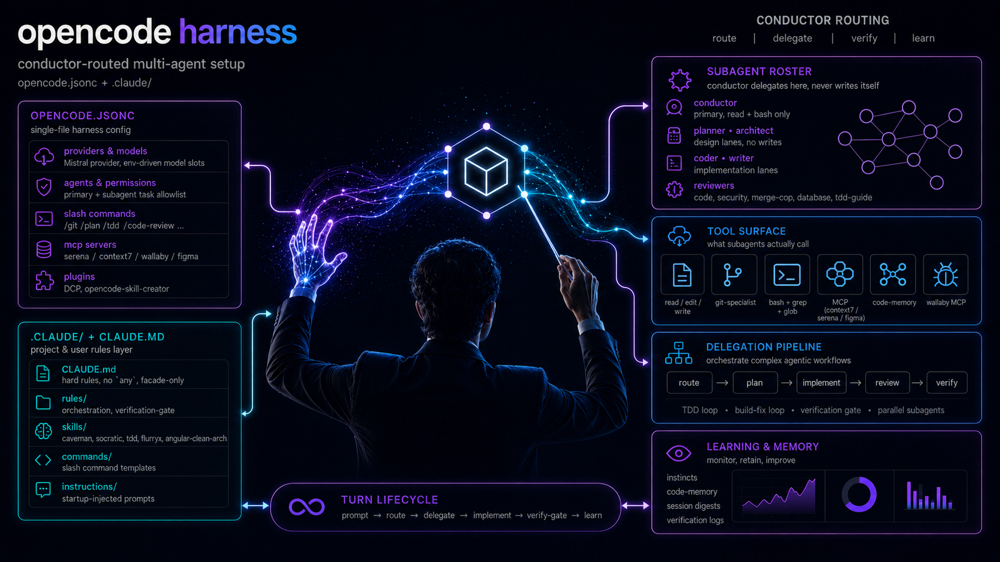

<p align="center">
  
</p>

<p align="center">
  <a href="https://github.com/fmflurry/code-memory"></a>
  <a href="LICENSE"></a>
  <a href="https://opencode.ai"></a>
  <a href="https://claude.com/claude-code"></a>
</p>

> ### Powered by [**CodeMemory**](https://github.com/fmflurry/code-memory)
>
> The semantic backbone of this harness. CodeMemory indexes the whole repo into a queryable memory of files, symbols, and episodes — so every agent walks into a session **already knowing the codebase** instead of grepping it back into existence on every turn.
>
> - **Orientation, not scanning.** One `code-memory_codememory_retrieve` call surfaces the right paths, symbols, and prior decisions; `grep`/`read` only run afterwards for exact verification.
> - **Cross-session memory.** Episodes and findings persist — agents pick up where the last session left off instead of re-discovering the repo from scratch.
> - **Wired in by default.** `instructions/codememory-first.md` is loaded at session start, and `code-memory_*` tools are pre-allowlisted for the conductor and every specialist subagent.

# OpenCode + Claude Code Setup

> My personal **OpenCode** and **Claude Code** configuration, kept public so I can sync it across machines — and so anyone curious can borrow what's useful. MIT licensed, fork freely. It evolves with my workflow, so treat it as a living reference rather than a stable distribution.

### Want to try it? Jump to **[Public install](#public-install)** — it takes about five minutes.

---

## What's inside

A hardened primary `conductor` agent backed by **25 specialist sub-agents**, wired together by a routing gate, a brief contract, and a verification gate. Here's the shape of it, counted fresh on **2026-10-02**:

| Thing                        | Count | Notes                                                                                  |
| ---------------------------- | ----- | -------------------------------------------------------------------------------------- |
| Agents                       | 26    | 1 `conductor` + 25 specialists (`build` / `plan` overrides ship disabled)              |
| Skills                       | 69    | canonical set in `skills/*/SKILL.md`; `skill-creator` is runtime-only and git-ignored  |
| Command templates            | 37    | `commands/*.md`; **21** pinned in `opencode.jsonc`                                      |
| Session-start instructions   | 12    | loaded from `instructions/` (`caveman-ultra.md` is not loaded)                          |
| `.claude` rule packs         | 22    | 17 under `rules/common/`, 5 under `rules/typescript/`                                   |
| Hooks                        | 7     | `.claude/hooks/*.sh`                                                                    |
| MCP servers                  | 6     | 1 enabled (`code-memory`), 5 disabled by default                                        |
| Custom tool files            | 4     | `run-tests`, `check-coverage`, `security-audit`, plus the `index.ts` barrel             |
| TUI plugins                  | 2     | `llm-metrics` sidebar + `panda-banner`                                                  |

What that buys you:

- **Mandatory sub-agent delegation** from `conductor`: the primary has `write` and `edit` denied at the permission layer. The orchestrator cannot patch files — every change MUST go through `coder` (source code), `writer` (docs/markdown/HTML), `tdd-guide` (tests), or `git-specialist` (commits/PRs). Routing is **model-agnostic**: even open-weight models that ignore prose rules are mechanically forced to delegate.
- **A front-loaded first-tool gate** in `prompts/agents/conductor.txt`: hard rules at the top, routing table second, six few-shot User → `task` examples (with explicit wrong-way contrasts) so literal models copy the right pattern.
- **Slash commands** that force routing to the right specialist (`/plan`, `/tdd`, `/security`, `/cop-review`, …).
- **Always-on instructions** loaded at session start — routing, question handling, CodeMemory-first orientation, verification gate, harness parity, brief contract, tool budget, comment discipline, git workflow, worktree safety, coding style, testing.
- **OpenCode plugins** — `.env` secret-file guard, desktop notifications, LLM metrics, a tool-budget nudge, Mistral cache affinity, and CodeMemory nudges.
- **Custom tools** — `run-tests`, `check-coverage`, `security-audit`.
- **A `.claude/` mirror** — hooks, rule packs, agents, and skills, so Claude Code benefits from the same guardrails.

The two halves stand alone. Use the OpenCode side, the Claude Code mirror, or both — whichever you'd find useful.

## Table of contents

- [Public install](#public-install)
- [English](#english)
  - [Goals](#goals-en)
  - [Repository layout](#layout-en)
  - [Configuration](#config-en)
  - [How the harness works today](#harness-en)
  - [Agents](#agents-en)
  - [Slash commands](#commands-en)
  - [Skills](#skills-en)
  - [Instructions & rules](#instructions-en)
  - [Plugins & hooks](#plugins-en)
  - [Custom tools](#tools-en)
  - [TUI plugins](#tui-en)
  - [Claude Code mirror](#claude-en)
  - [Sync & update](#sync-en)
  - [How it fits together](#flow-en)
- [Français](#francais)
  - [Objectif](#objectif-fr)
  - [Structure du repo](#structure-fr)
  - [Configuration](#config-fr)
  - [Agents](#agents-fr)
  - [Comment marche le harness](#harness-fr)
  - [Commandes slash](#commands-fr)
  - [Skills](#skills-fr)
  - [Instructions & règles](#instructions-fr)
  - [Plugins & hooks](#plugins-fr)
  - [Outils custom](#tools-fr)
  - [TUI plugins](#tui-fr)
  - [Mirror Claude Code](#claude-fr)
  - [Sync & mise a jour](#sync-fr)
  - [Comment tout s'emboite](#flow-fr)

---

<a id="public-install"></a>

## Public install

The repo is designed to merge into `~/.config/opencode/`, plus an optional `~/.claude/` mirror. There are three paths: a **one-line install** (recommended — nothing to clone by hand), a one-shot script if you already have the repo, and a manual walk-through if you want to see every step.

### One-line install

You don't need to clone anything first. The bootstrap fetches the repo into `~/.local/share/settings-opencode` (override with `SETTINGS_OPENCODE_SRC`), then runs the installer. **Re-running the exact same command is also how you update** — it pulls the latest and re-applies it.

**macOS / Linux / WSL** (bash):

```bash
curl -fsSL https://raw.githubusercontent.com/fmflurry/settings-opencode/master/bootstrap.sh | bash
```

On WSL it installs to the **Windows** side (`/mnt/c/Users/<you>/.config/opencode`), matching `install.sh`'s WSL behaviour. Pass installer flags through after `-s --`:

```bash
curl -fsSL https://raw.githubusercontent.com/fmflurry/settings-opencode/master/bootstrap.sh | bash -s -- --local
curl -fsSL https://raw.githubusercontent.com/fmflurry/settings-opencode/master/bootstrap.sh | bash -s -- --no-claude
curl -fsSL https://raw.githubusercontent.com/fmflurry/settings-opencode/master/bootstrap.sh | bash -s -- --uninstall
```

**Native Windows** (PowerShell — no WSL):

```powershell
irm https://raw.githubusercontent.com/fmflurry/settings-opencode/master/bootstrap.ps1 | iex
```

Merges into `%USERPROFILE%\.config\opencode` and `\.claude`, runs `npm install` (or `bun install`), and writes the `OPENCODE_*` defaults as **persistent User environment variables**. Open a new terminal afterwards so they take effect. Variants:

```powershell
# project-scoped install
& ([scriptblock]::Create((irm https://raw.githubusercontent.com/fmflurry/settings-opencode/master/bootstrap.ps1))) -Local
# skip the Claude mirror
& ([scriptblock]::Create((irm https://raw.githubusercontent.com/fmflurry/settings-opencode/master/bootstrap.ps1))) -NoClaude
# skip OpenCode (install Claude only)
& ([scriptblock]::Create((irm https://raw.githubusercontent.com/fmflurry/settings-opencode/master/bootstrap.ps1))) -NoOpencode
# uninstall (removes the OPENCODE_* env vars; leaves copied config in place)
& ([scriptblock]::Create((irm https://raw.githubusercontent.com/fmflurry/settings-opencode/master/bootstrap.ps1))) -Uninstall
```

### Prerequisites

- macOS, Linux, WSL, or native Windows.
- [OpenCode CLI](https://opencode.ai) installed and on your `PATH` (unless installing Claude Code only via `--no-opencode`).
- [Claude Code](https://claude.com/claude-code) installed if you want the `.claude/` mirror (unless skipped via `--no-claude`).
- Either [Bun](https://bun.sh) (recommended — `bun.lock` is what's checked in) or Node.js **>=22.6** with `npm`.
- `git`.

### Secrets

This repo stores **no API keys**. If you use the `myMistral` provider in `opencode.jsonc`, set `MISTRAL_API_KEY` by:
- Copying `.env.example` → `.env` and filling in your key, OR
- Exporting `MISTRAL_API_KEY` in your shell rc.

Other providers (Anthropic, OpenAI, GitHub Copilot, OpenCode Go) need their own keys set the same way if you select their profiles. All local `.env*` files are git-ignored; only `.env.example` is tracked.

### Quick install (script)

Already have the repo cloned? Run the installer directly:

```bash
git clone https://github.com/fmflurry/settings-opencode.git ~/Workspace/settings-opencode
cd ~/Workspace/settings-opencode
./install.sh
```

`install.sh` is interactive by default. It will prompt for each of two independent targets (OpenCode and Claude Code):

1. Verify your prerequisites (`git`, `bun`/`npm`).
2. **OpenCode** (if selected): merge repo files into `~/.config/opencode` (or `./.opencode` if `--local`) without removing existing user config.
3. Run `bun install` (or `npm ci` if Bun isn't available).
4. Sync skills from the canonical set into both harnesses via `scripts/sync-skills.sh`.
5. Seed personal config files (`settings.json`, `settings.local.json`, `policy-limits.json`) **only on first install**; preserve user edits on reinstall.
6. Add the `OPENCODE_MODEL_*` and `OPENCODE_REASONING_*` defaults to your shell rc, fenced with markers so re-runs and uninstalls are idempotent (OpenCode only, skipped if `--local`).
7. **Claude Code** (if selected): merge `.claude/` into `~/.claude` (or `./.claude` if `--local`).
8. Print a smoke-test command and the locations to tweak afterwards.

Useful flags:

| Flag            | Behaviour                                                                                                                                                                                   |
| --------------- | ------------------------------------------------------------------------------------------------------------------------------------------------------------------------------------------- |
| _(none)_        | Interactive walk-through: prompt `[Y/n]` for OpenCode (default Y) and Claude Code (default Y).                                                                                               |
| `--yes`, `-y`   | Non-interactive — accept all defaults: OpenCode ✓, Claude Code ✓. Existing normal directories are merged, not removed or backed up.                                                           |
| `--local`       | Project-scoped install into the current directory (`./.opencode`, `./.claude` as independent siblings); skips the global shell-rc env block (prints it as a hint instead).                   |
| `--opencode`    | **Allow-list:** install OpenCode only (if combined with other flags, only those are installed).                                                                                             |
| `--claude`      | **Allow-list:** install Claude Code only.                                                                                                                                                   |
| `--no-opencode` | **Deny:** skip OpenCode entirely (repo copy, deps, and env block). Can be combined with other targets.                                                                                      |
| `--no-claude`   | **Deny:** skip the Claude Code mirror. Can be combined with other targets.                                                                                                                  |
| `--uninstall`   | Remove the env-var block and optionally remove copied local/global dirs after confirmation. **Never deletes the cloned repo or your data without confirmation.**                               |
| `--help`, `-h`  | Print usage.                                                                                                                                                                                |

The script writes a fenced block to your shell rc (`~/.zshrc`, `~/.bashrc`, or `~/.config/fish/config.fish`) that looks like this:

```bash
# >>> settings-opencode >>>
# Added by settings-opencode installer. Edit values to match your provider.
# Defaults target the myMistral provider configured in opencode.jsonc.
export OPENCODE_MODEL_CONDUCTOR="myMistral/mistral-medium-2604"
export OPENCODE_MODEL_SUBAGENT_PLANNER="myMistral/mistral-large-latest"
export OPENCODE_MODEL_SUBAGENT_WORKER="myMistral/mistral-medium-latest"
export OPENCODE_MODEL_SUBAGENT_MINI="myMistral/mistral-small-latest"
export OPENCODE_REASONING_CONDUCTOR="high"
export OPENCODE_REASONING_PRIMARY="high"
export OPENCODE_REASONING_SECONDARY="medium"
export OPENCODE_REASONING_TERTIARY="low"
# <<< settings-opencode <<<
```

Edit the values inside the markers to point at whichever provider you use. Re-running `./install.sh` rewrites the same block; `./install.sh --uninstall` removes it cleanly.

If your shell isn't bash/zsh/fish, the script prints the env block for you to paste manually and continues with the rest of the install.

### Manual install

<details>
<summary>Click to expand the step-by-step manual walk-through (same outcome as the script).</summary>

#### 1. Clone the repo, then merge it into the OpenCode config dir

OpenCode loads `~/.config/opencode/opencode.jsonc` at startup. Keep the repo wherever you like, then copy it additively into the config dir.

```bash
# Clone
git clone https://github.com/fmflurry/settings-opencode.git ~/Workspace/settings-opencode
mkdir -p ~/.config/opencode
rsync -a --exclude node_modules --exclude .git ~/Workspace/settings-opencode/ ~/.config/opencode/
cd ~/.config/opencode
```

#### 2. Install plugin/tool dependencies

```bash
bun install        # uses bun.lock
# or
npm ci
```

#### 3. Set the model + reasoning environment variables

The `agent` block in `opencode.jsonc` is parameterized via env vars so you can swap providers without editing the config. Add these to your shell profile (`~/.zshrc`, `~/.bashrc`, etc.):

```bash
# Required (OpenCode model identifiers — adjust to whatever provider you use)
export OPENCODE_MODEL_CONDUCTOR="myMistral/mistral-medium-2604"
export OPENCODE_MODEL_SUBAGENT_PLANNER="myMistral/mistral-large-latest"
export OPENCODE_MODEL_SUBAGENT_WORKER="myMistral/mistral-medium-latest"
export OPENCODE_MODEL_SUBAGENT_MINI="myMistral/mistral-small-latest"

# Reasoning effort tiers
export OPENCODE_REASONING_CONDUCTOR="high"
export OPENCODE_REASONING_PRIMARY="high"
export OPENCODE_REASONING_SECONDARY="medium"
export OPENCODE_REASONING_TERTIARY="low"
```

If your provider doesn't support `reasoningEffort`, OpenCode silently ignores it — pick any value.

#### 4. Install MCP server prerequisites

`opencode.jsonc` declares six MCP servers: one enabled by default (`code-memory`) and five disabled (`context7`, `blender`, `wallaby`, `Figma`, `smartbear-swagger`). **CodeMemory is strongly recommended** — `instructions/codememory-first.md` routes repo orientation through it before falling back to `grep`/`read`. The others are optional but documented here so you know what you're opting into.

| Server            | Install                                                                                        | Status                                                                                                                                                   |
| ----------------- | ---------------------------------------------------------------------------------------------- | -------------------------------------------------------------------------------------------------------------------------------------------------------- |
| code-memory       | `uvx --from flurryx-code-memory@latest code-memory-mcp` (auto-installed on first use)          | **Recommended.** Enabled. Semantic repo orientation; `code-memory_*` tools are pre-allowlisted for every subagent. Pairs with `instructions/codememory-first.md`. |
| context7          | nothing — `npx -y @upstash/context7-mcp@latest`                                                | Disabled by default. Live docs lookup.                                                                                                                    |
| blender           | `uv --directory $HOME/dev/blender_mcp/mcp run blender-mcp`                                     | Disabled by default. Blender scene tooling; drives the `gaudi` agent when enabled.                                                                        |
| wallaby           | install [Wallaby.js](https://wallabyjs.com) and run `wallaby update-mcp`                       | Disabled by default. Runtime-test introspection.                                                                                                          |
| Figma             | remote — `https://mcp.figma.com/mcp`                                                           | Disabled by default. Flip `enabled: true` and set up [Figma MCP](https://help.figma.com) for design-system tools.                                          |
| smartbear-swagger | remote — `https://swagger.mcp.smartbear.com/mcp`                                               | Disabled by default. OpenAPI/Swagger tooling for `api-spec-architect`.                                                                                    |

#### 5. (Optional) Install the Claude Code mirror

The repo ships a `.claude/` subtree. OpenCode and Claude Code can be installed separately and never nest inside one another.

**Claude Code:**

```bash
mkdir -p ~/.claude
rsync -a ~/.config/opencode/.claude/ ~/.claude/
```

What this installs:

- `.claude/CLAUDE.md` — global user instructions Claude Code reads on every session.
- `.claude/settings.json` — permissions, hooks, env vars (`API_TIMEOUT_MS`, autocompact threshold, etc.). Seeded on first install only; user edits preserved on reinstall.
- `.claude/hooks/*.sh` — pre-tool-use security warnings + stop hook.
- `.claude/rules/{common,typescript}/*.md` — coding-style/testing/security rule packs.
- `.claude/commands/*.md` — extra slash commands (`/create-pull-request`, `/update-codemaps`, and the Claude-only arena commands).
- `.claude/skills/**` — the skill mirror, synced from the canonical set by `scripts/sync-skills.sh` on install.

</details>

### Smoke test

```bash
opencode
```

You should see:

- The `llm-metrics` TUI sidebar and the panda banner show up.

Then drop a slash command:

```
/plan add a TODO list to my homepage
```

It should route to the `planner` sub-agent and return a structured plan without writing code.

### Changing models

Edit the `OPENCODE_MODEL_*` / `OPENCODE_REASONING_*` exports in your shell rc (`~/.zshrc`, `~/.bashrc`, …), then open a new shell.

### Updating

If you installed via the one-liner, **re-run the exact same command** — it pulls the latest and re-applies it:

```bash
# macOS / Linux / WSL
curl -fsSL https://raw.githubusercontent.com/fmflurry/settings-opencode/master/bootstrap.sh | bash
```

```powershell
# native Windows
irm https://raw.githubusercontent.com/fmflurry/settings-opencode/master/bootstrap.ps1 | iex
```

If you cloned the repo by hand instead:

```bash
cd ~/.config/opencode
git pull
./install.sh --yes        # refreshes deps + env block; idempotent
# or, if you want to do it by hand:
# bun install   (or: npm ci)
```

If a new plugin shows up, OpenCode picks it up on the next restart. If an env var is added to `opencode.jsonc`, this README will mention it.

---

<a id="english"></a>

## English

Dotfiles for OpenCode + the stable parts of `~/.claude`. Ships a hardened primary `conductor` agent (no write/edit perms — must delegate), **25 specialist sub-agents**, always-on instructions, slash commands, OpenCode plugins (secret-file guard, notifications, llm-metrics, tool-budget), custom tools, and a Claude Code mirror.

<a id="goals-en"></a>

### Goals

- Reproducibility: same agent behavior across machines/sessions.
- Quality: on-demand TDD, frequent verification, centralized conventions.
- Security: `security-review` skill available on demand + pre-tool-use hooks.

<a id="layout-en"></a>

### Repository layout

- Configs: `opencode.jsonc`, `dcp.jsonc` (dynamic context pruning), `tui.json` (TUI theme).
- Profiles: `profiles/<name>/` (per-profile overrides + `AGENTS.md`).
- Skills: `skills/*/SKILL.md` (plus auxiliary docs) — **canonical set, shared with Claude Code via** `sync-skills.sh`.
- Agent prompts: `prompts/agents/*.txt` (26 files).
- Slash commands: `commands/*.md` (37 templates).
- OpenCode plugins: `plugins/*.{ts,js}` + `plugins/kdco-primitives/` + `plugins/llm-metrics-lib/` + `plugins/code-memory-lib/` + `plugins/lib/`.
- TUI plugins: `tui-plugins/*.tsx`.
- Custom tools: `tools/*.ts`.
- Mode notes: `contexts/*.md`.
- Global instructions: `instructions/*.md` (12 loaded at session start; `caveman-ultra.md` is present but not loaded).
- Scripts: `scripts/setup-package-manager.js`, `scripts/codemaps/generate.ts`, `scripts/llm-metrics-dashboard.ts` (live llm-metrics dashboard), `scripts/settings-sync.sh`, `scripts/sync-skills.sh` (sync canonical skill set to both harnesses), `scripts/skill-drift-check.sh` (read-only drift detector).
- Install entry points: `bootstrap.sh`, `bootstrap.ps1`, `install.sh`, `install-cursor.sh`.
- Claude mirror: `.claude/CLAUDE.md`, `.claude/settings.json`, `.claude/hooks/`, `.claude/rules/`, `.claude/agents/`, `.claude/skills/` (synced from the canonical set on install), `.claude/commands/`.
- Intentional exclusions (`.gitignore`): `node_modules/`, `antigravity-*`, `.DS_Store`, local `.env*` files except `.env.example`, runtime dir `skills/skill-creator/` (not synced).

<a id="config-en"></a>

### Configuration: `opencode.jsonc`

Six concerns wired in one file:

1. `instructions`: always-on docs loaded at session start. Currently **12**:
   - `instructions/subagent-routing.md` — Task-first subagent delegation gate.
   - `instructions/question-handling.md` — blocking vs non-blocking question protocol.
   - `instructions/codememory-first.md` — prefer [CodeMemory](https://github.com/fmflurry/code-memory) MCP (`code-memory_*` tools) for repo orientation before `grep`/`read`.
   - `instructions/verification-gate.md` — independent build/test verification before "done".
   - `instructions/harness-parity.md` — keep `.claude/` and `.opencode/` in parity.
   - `instructions/brief-contract.md` — the 6-field subagent brief contract.
   - `instructions/tool-budget.md` — verification-vs-exploration budget.
   - `instructions/code-comments.md` — comment truthfulness + forbidden classes.
   - `instructions/git-workflow.md` — commit cohesion, staging discipline, English commit messages.
   - `instructions/worktree-destruction-safety.md` — pre-removal checks before destroying a worktree.
   - `instructions/coding-style.md` — immutability, file size, naming, error handling.
   - `instructions/testing.md` — 80%+ coverage, RED-GREEN-REFACTOR, test types.
   > `instructions/caveman-ultra.md` sits in the repo but is **not** in the `instructions` array, so it isn't loaded at session start.
2. `default_agent`: `conductor` (orchestrator-only — cannot write/edit).
3. `agent`: 26 definitions (model + reasoning effort + prompt + tool allowlist). All models are env-driven (`OPENCODE_MODEL_*`, `OPENCODE_REASONING_*`) — see [Public install](#public-install).
4. `command`: maps `/<name>` -> template + sub-agent + `subtask`; **21** entries are pinned here.
5. `mcp`: six servers — `code-memory` enabled; `context7`, `blender`, `wallaby`, `Figma`, `smartbear-swagger` disabled by default. `code-memory_*` perms are pre-allowlisted for every subagent.
6. `plugin`: npm + local plugins — `opencode-skill-creator` (npm) plus five local files (which OpenCode also auto-loads from the plugin directory).

`dcp.jsonc` is the config stub for the optional external Dynamic Context Pruning plugin.

<a id="harness-en"></a>

### How the harness works today

The interesting part isn't the agent list — it's the machinery that keeps a literal model on rails. Each rule lives in an `instructions/` file loaded at startup.

#### 1. The conductor cannot write

`conductor` has `tools.write: false`, `tools.edit: false`, and `permission.edit/write: deny` in `opencode.jsonc`. Its Task allowlist enumerates every legal specialist; `*: deny` blocks the rest. The orchestrator has **no file-mutation tool** — it must dispatch a `task` to `coder`, `writer`, `tdd-guide`, or `git-specialist`. `instructions/subagent-routing.md` adds a first-tool gate: if the request matches a specialist, the very first tool call must be that dispatch.

#### 2. Agent selection at a glance

| You want…                                   | Route to                                    |
| ------------------------------------------- | ------------------------------------------- |
| A plan, risk list, or phased breakdown       | `planner`                                   |
| Architecture / scalability / module boundaries | `architect`                               |
| Non-test implementation                     | `coder`                                     |
| Docs, README, markdown, HTML, release notes | `writer`                                    |
| Diff / PR / current-change review           | `code-reviewer`                             |
| Tests and coverage                          | `tdd-guide` (delegates impl to `coder`)     |
| Build, typecheck, lint, or TS errors        | `build-error-resolver`                      |
| Git, commits, branches, pushes, PRs         | `git-specialist`                            |
| Security / auth / secrets / user input      | `security-reviewer`                         |
| GDPR / privacy / cookies / PII              | `gdpr-specialist`                           |
| Angular or .NET pre-merge review            | `angular-cop` / `dotnet-cop`                |
| SQL / schema / migrations / RLS             | `database-reviewer`                         |
| Live PostgreSQL instance diagnostics        | `postgres-dba`                              |
| OpenAPI specs                               | `api-spec-architect`                        |
| Unknown file scope for a brief              | `scout`                                     |
| Dead code / duplication cleanup             | `refactor-cleaner`                          |
| Generated docs / codemaps                   | `doc-updater`                               |
| E2E browser journeys                        | `e2e-runner`                                |
| Harness / skill / agent parity audit        | `ecosystem-auditor`                         |
| Comment judging / purge                     | `comment-judge` (purge via `haruspex-commentorum`) |
| Blender / 3D art                            | `gaudi` (triggered-only)                    |

#### 3. Canonical flows

Most non-trivial work follows a fixed order, so planning, implementation, and review never collapse into one agent:

```
planner → (tdd-guide → coder) or coder → code-reviewer → verify → git-specialist
```

A test-first variant routes `tdd-guide` first (RED), then `tdd-guide` delegates the GREEN implementation to `coder`, then `code-reviewer`, then the verification gate, then `git-specialist`. Docs-only work short-circuits to `writer`.

#### 4. The brief contract

Before dispatching `coder`, `writer`, or `tdd-guide`, the conductor emits a **6-field brief** (`instructions/brief-contract.md`): `TASK` (one imperative outcome), `FILES` (authoritative path + line ranges), `CHANGE` (named target state), `DONE-WHEN` (an executable command that must exit 0), `OUT OF SCOPE`, and `CONTEXT ALREADY RESOLVED` — plus a `BUDGET`. Precise briefs cost roughly 4× fewer tokens than open-ended ones, so this is enforced, not advice.

#### 5. Question handling

Subagents that hit an ambiguity must tag their question `[BLOCKING]` or `[NON-BLOCKING]` (`instructions/question-handling.md`). Blocking questions stop the agent; the conductor tries to answer from the repo first, then asks the human. Non-blocking questions let work continue with a stated default and are batched and reported at the end of the job.

#### 6. The verification gate

Nobody says "done" without fresh evidence (`instructions/verification-gate.md`). After any source edit, the agent detects the project type from manifests, runs the matching build/typecheck/lint command itself (subagent self-reports are not proof), runs the tests if behavior changed, and pastes the tail of the real output. Two failed fix passes on the same error → stop and escalate.

#### 7. Tool budget

`instructions/tool-budget.md` separates **verification** commands (build, test, git state — uncapped) from **exploratory** shell (listing, grepping, file inspection — default 3 per dispatch). It nudges the model toward CodeMemory and targeted `read` ranges instead of full-file reads, and requires a one-line justification when the exploratory ratio runs high.

#### 8. Worktree destruction safety

Removing a worktree is treated like `rm -rf`, not bookkeeping (`instructions/worktree-destruction-safety.md`). Before any removal the agent runs `git status --porcelain`, checks for commits not on the base branch, and — in Orca-managed repos — routes through `orca worktree rm` so the trash step runs. Any dirty tree or unpushed commit is a hard stop reported to the human.

#### 9. Codememory-first

When the `code-memory` MCP server is connected, its tools are the mandatory first choice for search, callers, definitions, importers, and dependencies (`instructions/codememory-first.md`). `grep`/`glob`/`bash` are fallbacks only — raw listing, filename globs, or a known path region. This is the rule that makes orientation cheap for every other agent.

### Hardened sub-agent orchestration

Delegation is enforced at **two layers**, so the same behavior holds whether the primary model is Claude, GPT, DeepSeek, or any open-weight runner that ignores prose hints:

1. **Permissions** — `conductor` has `tools.write: false`, `tools.edit: false`, and `permission.edit/write: deny` in `opencode.jsonc`. The Task allowlist enumerates every legal specialist; `*: deny` blocks anything else. The orchestrator literally has no file-mutation tool.
2. **Guard plugins + front-loaded prompt** — `plugins/secret-file-guard.ts` aborts any `read`/`bash` access to a secret-bearing `.env` file; `plugins/tool-budget.ts` nudges verification over exploration (it never blocks a call). `prompts/agents/conductor.txt` puts hard rules in the first lines, the routing table second, and six worked few-shot examples showing User → `task` calls with explicit wrong-way contrasts; `instructions/subagent-routing.md` enforces a Task-first gate before direct inspection.

Use these paths depending on how much control you want:

- Plain request: `conductor` consults the routing table and dispatches the matching specialist via Task.
- `@agent` mention: manually invokes a specific subagent in the conversation.
- Slash command: forces a subtask with a configured template, e.g. `/plan`, `/tdd`, `/security`.

Why this exists: GPT/Claude often infer delegation from short descriptions, but open-source/open-weight models are more literal and tend to inspect or edit first. Permissions + the front-loaded gate make delegation **mechanically enforced** rather than instruction-dependent.

<a id="agents-en"></a>

### Agents

Defined in `opencode.jsonc` under `agent` — **26 entries**: the primary plus 25 subagents. `build` and `plan` are built-in overrides and ship **disabled**.

| Agent                  | Access          | Role                                                                                                                    | Trigger notes                     |
| ---------------------- | --------------- | ----------------------------------------------------------------------------------------------------------------------- | --------------------------------- |
| `conductor`            | read-only       | Primary orchestrator. `write`/`edit` denied; every change routed via Task.                                              | Default agent — always on         |
| `planner`              | read-only       | Plan + risks + phased order before large changes. No edit.                                                              | Complex features, unclear order   |
| `architect`            | read-only       | System design, scalability, cross-module boundaries.                                                                    | High-impact design decisions      |
| `coder`                | writable        | Pure non-test implementation. Build+lint+standards self-check before reporting. Socratic ambiguity gate.                | Any source-code change            |
| `writer`               | writable        | Docs/markdown/HTML/text artifacts. Refuses source files.                                                                | Prose, README, ADRs, reports      |
| `code-reviewer`        | read-only       | General diff/PR review. Findings only; fixes go to `coder`. Owns `/cop-review`.                                         | Review requests                   |
| `comment-judge`        | read-only       | Rubric verdict on added/changed comments; REVIEW (diff) or PURGE (directory). Emits JSON.                               | Comment review / purge            |
| `haruspex-commentorum` | writable        | Comment-deleting purge agent. Applies agreed verdicts.                                                                  | **Triggered-only** by purge flow  |
| `ecosystem-auditor`    | read-only       | Evidence-first audit of OpenCode/Claude parity and harness coherence.                                                   | `/ecosystem-audit`, parity checks |
| `angular-cop`          | read-only       | Angular + TypeScript pre-merge review (signals, RxJS, flurryx, TS strict). Runs `tsc` + lint.                           | Angular PR review                 |
| `dotnet-cop`           | read-only       | .NET 10 Minimal API review (ports/adapters, modular isolation, EF Core). Runs build + `dotnet format`.                  | .NET PR review                    |
| `gdpr-specialist`      | read-only       | GDPR/CNIL compliance review (consent, cookies, PII, retention, transfers, 72h breach).                                  | Privacy-sensitive features        |
| `security-reviewer`    | read-only       | OWASP/secrets/deps review. Reports vulnerabilities; fixes routed to `coder`.                                            | Auth, input, endpoints, secrets   |
| `tdd-guide`            | writable (tests)| RED → GREEN → REFACTOR + 80% coverage. Delegates GREEN impl to `coder` via scoped Task perm.                             | New features, bug fixes, refactors|
| `build-error-resolver` | writable        | Fixes build/typecheck/lint/TS errors with minimal diffs.                                                                | Red build or lint                 |
| `e2e-runner`           | writable        | Playwright E2E tests, run + artifacts.                                                                                  | Browser journeys                  |
| `doc-updater`          | writable        | Generated docs + codemaps.                                                                                               | `/update-docs`, `/update-codemaps`|
| `refactor-cleaner`     | writable        | Dead-code removal + consolidation, behavior preserved.                                                                  | Cleanup requests                  |
| `database-reviewer`    | read-only       | PostgreSQL/Supabase schema, query perf, RLS, migrations.                                                                | SQL/migration/schema review       |
| `postgres-dba`         | read-only       | Live instance ops: health, vacuum/bloat, WAL, backups/PITR, pooling, upgrades. Emits human-confirmed commands.          | `/db-health`, `/db-backup-check`  |
| `api-spec-architect`   | writable        | Zalando-compliant OpenAPI 3.1 specs; optional SwaggerHub publish.                                                       | `/api-spec`                       |
| `git-specialist`       | writable (git)  | Branches, staged commits, pushes, PRs. Mini model.                                                                      | Git/commit/PR tasks               |
| `scout`                | read-only       | Emits a file manifest for an unknown scope before a brief.                                                              | **Triggered-only** by conductor   |
| `why-investigator`     | read-only       | Investigates one evidence category for design rationale.                                                               | **Triggered-only** by `why` skill |
| `why-synthesizer`      | read-only       | Merges investigator findings into one evidence-weighted answer.                                                          | **Triggered-only** by `why` skill |
| `gaudi`                | writable        | Blender / 3D art: modeling, materials, lighting, render, glTF export. Drives the Blender MCP.                           | **Triggered-only** (3D work)      |

**Model tiers.** Each agent draws its model from one of four env vars, and reasoning effort from a tier:

| Env var                          | Feeds                                                    |
| -------------------------------- | -------------------------------------------------------- |
| `OPENCODE_MODEL_CONDUCTOR`       | `conductor`                                              |
| `OPENCODE_MODEL_SUBAGENT_PLANNER`| `planner`, `api-spec-architect`, `why-synthesizer`       |
| `OPENCODE_MODEL_SUBAGENT_WORKER` | `architect`, `coder`, `writer`, `code-reviewer`, and most reviewers |
| `OPENCODE_MODEL_SUBAGENT_MINI`   | `git-specialist`, `scout`, `why-investigator`            |
| `OPENCODE_REASONING_CONDUCTOR`   | `conductor` reasoning effort                             |
| `OPENCODE_REASONING_PRIMARY`     | high-effort tier                                         |
| `OPENCODE_REASONING_SECONDARY`   | medium-effort tier                                       |
| `OPENCODE_REASONING_TERTIARY`    | low-effort tier                                          |

<a id="commands-en"></a>

### Slash commands

**37 templates** live in `commands/`. Most run as `subtask: true` (delegated to a specialist). **21 are pinned** in the `opencode.jsonc` `command` block — those are the guaranteed set. OpenCode reads the pinned block; whether it additionally auto-discovers `commands/` is something I can't verify from this repo, so treat unpinned entries as Claude-side or discovery-dependent.

Pinned (21):

| Command            | Sub-agent            | Purpose                              |
| ------------------ | -------------------- | ------------------------------------ |
| `/git`             | git-specialist       | Bounded git ops (branches, commits). |
| `/push-changes`    | git-specialist       | Commit + push with upstream guard.   |
| `/plan`            | planner              | Implementation plan.                 |
| `/tdd`             | tdd-guide            | TDD cycle with coverage.             |
| `/api-spec`        | api-spec-architect   | OpenAPI 3.1 spec generation.         |
| `/cop-review`      | code-reviewer        | Direct pre-merge review; selects stack guidance. |
| `/security`        | security-reviewer    | Security audit.                      |
| `/gdpr-review`     | gdpr-specialist      | GDPR/CNIL compliance audit.          |
| `/build-fix`       | build-error-resolver | Build/TS error resolution.           |
| `/e2e`             | e2e-runner           | E2E test generation/run.             |
| `/refactor-clean`  | refactor-cleaner     | Dead-code cleanup.                   |
| `/orchestrate`     | planner              | Multi-agent orchestration.           |
| `/verify`          | (conductor)          | Verification loop.                   |
| `/eval`            | (conductor)          | Evaluate against criteria.           |
| `/update-docs`     | doc-updater          | Doc updates.                         |
| `/update-codemaps` | doc-updater          | Generates `docs/CODEMAPS/`.          |
| `/test-coverage`   | tdd-guide            | Coverage analysis.                   |
| `/skill-create`    | (conductor)          | Generate a skill from git history.   |
| `/db-health`       | postgres-dba         | Read-only PostgreSQL health battery. |
| `/dependabot-friday`| git-specialist      | Dependabot PR triage (report-only).  |
| `/db-backup-check` | postgres-dba         | Backup/PITR posture audit.           |

Unpinned templates (16) — available in `commands/`, plus Claude-side/OpenSpec helpers:

`/checkpoint`, `/pm2`, `/setup-pm`, `/ecosystem-audit`, `/create-pull-request`, and the OpenSpec family `/opsx-{new,ff,continue,apply,verify,archive,bulk-archive,sync,explore,propose,onboard}`.

**Claude-only:** `.claude/commands/` adds `arena.md` and `arena-new-prompt.md` (the arena/chimera flow) plus the OpenSpec command dir — those are not pinned for OpenCode.

<a id="skills-en"></a>

### Skills

**69 skills** in `skills/*/SKILL.md`, grouped by theme. `scripts/sync-skills.sh` computes the canonical union (root `skills/` ∪ `.claude/skills/`, root wins on conflicts), excludes the runtime dir `skills/skill-creator/`, and copies into both harness targets. Attribution for vendored skills lives in [`skills/THIRD_PARTY_NOTICES.md`](skills/THIRD_PARTY_NOTICES.md).

- **Planning & design (5):** `socratic-design`, `chimera`, `api-spec-openapi`, `why`, `blast-radius`.
- **Review & quality (5):** `comment-judge`, `interfectio-commentarum`, `verify-this`, `test-behavior-not-implementation`, `ai-ecosystem-audit`.
- **TDD & testing (2):** `tdd-workflow`, `tdd`.
- **CI & git (5):** `fix-ci`, `fix-merge-conflicts`, `get-pr-comments`, `loop-on-ci`, `git-workflow`.
- **Angular (4):** `angular-clean-architecture`, `angular-ddd`, `angular-cop`, `angular-accessibility`.
- **.NET (3):** `dotnet-clean-architecture`, `dotnet-ddd`, `dotnet-cop`.
- **Three.js / 3D (10):** `threejs-fundamentals`, `threejs-geometry`, `threejs-materials`, `threejs-textures`, `threejs-lighting`, `threejs-animation`, `threejs-interaction`, `threejs-shaders`, `threejs-loaders`, `threejs-postprocessing`.
- **PostgreSQL playbooks (4):** `postgres-health-check`, `postgres-performance-tuning`, `postgres-backup-restore`, `postgres-container-ops`.
- **Playwright E2E (2):** `playwright-e2e-authoring`, `playwright-e2e-review`.
- **OpenSpec workflow (11):** `openspec-new-change`, `openspec-ff-change`, `openspec-continue-change`, `openspec-apply-change`, `openspec-verify-change`, `openspec-archive-change`, `openspec-bulk-archive-change`, `openspec-sync-specs`, `openspec-explore`, `openspec-propose`, `openspec-onboard`.
- **Writing & communication (8):** `humanizer`, `for-real`, `caveman`, `caveman-commit`, `caveman-review`, `show-me`, `show-your-work`, `compress`.
- **Harness & config (5):** `config-sync`, `harness-parity`, `skill-authoring`, `treetopia`, `strategic-compact`.
- **Security (1):** `security-review`.
- **Compliance (1):** `gdpr-compliance`.
- **Domain (2):** `flurryx`, `transloco`.
- **Universal standards (1):** `coding-standards`.

The PostgreSQL and Playwright sets are **gc.platform-specific project playbooks**, not general-purpose skills — read them alongside the `postgres-dba` and `e2e-runner` agents.

`skill-creator` is a runtime-only skill: it is git-ignored (`skills/skill-creator/`) and never synced. `opencode-skill-creator` (npm) provides the same capability at runtime.

<a id="instructions-en"></a>

### Instructions & rules

**12 session-start instructions** (listed in [Configuration](#config-en)) are the operating rules every agent loads. They sit at `instructions/*.md` and cover: subagent routing, question handling, codememory-first, the verification gate, harness parity, the brief contract, tool budget, code comments, git workflow, worktree destruction safety, coding style, and testing.

The Claude Code side carries the same doctrine as **22 rule packs** under `.claude/rules/`: **17** in `rules/common/` (agents, brief contract, code comments, codebase exploration, coding style, git workflow, harness parity, hooks, orchestration, patterns, performance, question handling, security, testing, tool budget, verification gate, worktree safety) and **5** in `rules/typescript/` (coding style, hooks, patterns, security, testing).

Two top-level instruction files, distinct jobs:

- **Root `CLAUDE.md`** — behavioral guidelines for Claude Code agents (think before coding, simplicity, surgical changes, goal-driven execution, verification gate, delegation, destructive-action safety, tool hygiene). Project rule packs feed into it via `@rules/...` imports.
- **`.claude/CLAUDE.md`** — the global user instructions installed into `~/.claude`, carrying the cross-project essentials (`no any`, facade-not-UseCase).

<a id="plugins-en"></a>

### Plugins & hooks

All TypeScript plugins use `@opencode-ai/plugin@1.4.6`. OpenCode auto-loads every `.ts`/`.js` file in `plugins/`; the `plugin` array in `opencode.jsonc` additionally declares the npm plugin and re-references five local files.

- `plugins/secret-file-guard.ts` — hard-blocks `read`/`bash` access to secret-bearing `.env` files; `.env.example`/`.sample`/`.template` stay readable.
- `plugins/notification.ts` — desktop notifications on session completion and question/permission events; optional Bark/iPhone push.
- `plugins/mistral-affinity.js` — attaches a stable `x-affinity` header to Mistral / Mistral-compatible provider calls for cache affinity.
- `plugins/tool-budget.ts` — nudges the model toward verification over exploration via the system prompt (never blocks a tool call).
- `plugins/code-memory.ts` + `plugins/code-memory-lib/` — CodeMemory auto-retrieve / auto-learn nudges (no-op when the `code-memory` CLI is absent).
- `plugins/llm-metrics.ts` + `plugins/llm-metrics-lib/` — real-time LLM-behavior monitor: hooks bus events into per-call metrics (tokens, TTFT, duration, cost, model, finish reason, end-to-end + generation tok/s) appended as NDJSONL to `~/data/llm-metrics.jsonl`, backed by a shared pure core (110 unit tests). Local-only, no egress; response-text capture is bounded and opt-out. Full architecture, env knobs, tok/s definitions, subagent aggregation, and privacy boundary in [`LLM_METRICS.md`](LLM_METRICS.md).
- `plugins/kdco-primitives/` + `plugins/lib/` — shared utilities (mutex, shell, terminal-detect, project-id resolver, notification gate, types).
- `opencode-skill-creator` _(external npm, declared in `opencode.jsonc › plugin`)_ — skill scaffolding and benchmarking.
- _Not loaded:_ `plugins/ecc-hooks.ts.disabled`, `plugins/worktree.disabled`, `plugins/figma-rag.md`, and `tui-plugins/caveman.tsx.disabled` ship disabled and are skipped by the loader.

**Claude-side hooks** (`.claude/hooks/`, 7 scripts): `notification.sh`, `pre-tool-use.sh`, `prefer-code-memory.sh`, `rtk-rewrite.sh`, `stop.sh`, `subagent-stop.sh`, `tool-budget.sh`. `notification.ts` uses the shared `plugins/lib/notification-gate` logic so the two harnesses fire the same alerts.

<a id="tools-en"></a>

### Custom tools (`tools/`)

Reusable OpenCode tools exposed via `tools/index.ts`:

- `tools/run-tests.ts` — detects package manager + framework and builds the test command.
- `tools/check-coverage.ts` — reads coverage reports and compares against a threshold.
- `tools/security-audit.ts` — scans deps + secrets + risky patterns.

(`tools/index.ts` is the barrel that re-exports them.)

<a id="tui-en"></a>

### TUI plugins

- `tui-plugins/llm-metrics.tsx` — SolidJS sidebar (in the `sidebar_content` slot) showing live per-session LLM metrics: a streaming `~tok/s (est)`, latest-call generation/e2e tok/s, tokens in/out, model, cost, finish reason, TTFT, and a rolling-average tok/s. Aggregates the whole subagent subtree. See [`LLM_METRICS.md`](LLM_METRICS.md).
- `tui-plugins/panda-banner.tsx` — SolidJS banner that renders a panda ASCII/block-art header.

<a id="claude-en"></a>

### Claude Code mirror (`.claude/`)

- `CLAUDE.md` — global user instructions (no `any`, facade != UseCase).
- `settings.json` — allow/deny permissions, env (`API_TIMEOUT_MS=3000000`, `CLAUDE_CODE_DISABLE_NONESSENTIAL_TRAFFIC=1`, `CLAUDE_AUTOCOMPACT_PCT_OVERRIDE=80`), `PreToolUse` / `PostToolUse` / `Stop` hooks. Seeded on first install; personal edits preserved on reinstall.
- `hooks/*.sh` — seven hooks: pre-tool-use warnings, CodeMemory preference, RTK rewrite, tool-budget nudge, notification, stop, and subagent-stop.
- `rules/common/*.md` + `rules/typescript/*.md` — 22 rule packs (style, testing, security, patterns, hooks, agents, orchestration).
- `agents/*.md` — 26 agent definitions mirroring the OpenCode roster.
- `commands/*.md` — Claude commands (`/create-pull-request`, `/update-codemaps`, arena, OpenSpec).
- `skills/**` — the skill mirror, synced from the canonical set by `scripts/sync-skills.sh` on install. It is **not** guaranteed to equal today's `skills/` (the canonical set grows between syncs), so treat `skills/` as the source of truth and run `settings-sync --skills-only` to catch the mirror up.

<a id="sync-en"></a>

### Sync & update

Two directories, one source of truth. The **lab** is wherever you cloned this repo; the **live** config dirs are `~/.config/opencode` and `~/.claude`. Nothing here watches the filesystem — you pull, then sync.

- `install.sh` merges **additively** and never deletes user config. Re-running is safe and idempotent: it refreshes deps, re-merges repo files, and rewrites the marker-fenced env block.
- `scripts/settings-sync.sh` is the "from anywhere" command — `settings-sync` resolves the repo (via `SETTINGS_OPENCODE_REPO` or well-known clone paths) and runs a full install; `settings-sync --skills-only` runs the fast skills path; `--where` prints the resolved repo path.
- `scripts/sync-skills.sh` computes the canonical skill union and copies it into every active harness target. installers call it; you can run it standalone.
- `scripts/skill-drift-check.sh` is a **read-only** drift detector: it hashes every copy of a skill across the known roots (repo `.claude/skills`, `.opencode/skills`, `~/.config/opencode/skills`, `~/.claude/skills`) and exits non-zero when two copies of the same skill diverge. Also compares the kept-overlap instruction topics.
- The `config-sync` skill is the agent-facing version of the same job: edit an agent/rule/skill here, and it propagates the change across harness dirs.
- `install-cursor.sh` ports the skills, subagents, commands, rules, hooks, and MCP servers into `~/.cursor` as physical copies (no symlinks), so Cursor can run standalone. Flags: `--yes`, `--uninstall`, `--no-backup`.

**Parity phrasing:** the two harnesses are *synced on install*, not continuously identical. Right now `skills/` holds 69 skills while the shipped `.claude/skills/` mirror holds 52 — the canonical set outgrew the last sync. Run `settings-sync --skills-only` (or `scripts/sync-skills.sh`) to reconcile, and `scripts/skill-drift-check.sh` to confirm.

<a id="flow-en"></a>

### How it fits together

1. Startup: OpenCode loads `opencode.jsonc` -> 12 always-on instructions -> auto-loads every plugin in `plugins/` plus the TUI plugins registered in `tui.json`.
2. Dev: `conductor` executes — it cannot write files; it dispatches Task calls to specialists. `secret-file-guard` blocks `.env` access; `tool-budget` nudges verification over exploration.
3. Workflow: `conductor` routes to specialists through Task (perm-enforced); `/plan`, `/tdd`, `/security`, etc. force the same routing explicitly. The brief contract, question protocol, and verification gate bracket each hand-off.
4. Idle/completion: `llm-metrics` persists per-call metrics; `notification` sends completion/question/permission alerts.

---

<a id="francais"></a>

## Français

Depot "dotfiles" pour OpenCode + la partie stable de `~/.claude`. Embarque un agent principal `conductor` durci (write/edit interdits, delegation obligatoire), **25 sous-agents specialises**, des instructions toujours actives, des commandes slash, des plugins (secret-file guard, notifications, llm-metrics, tool-budget), des outils custom et un mirror Claude Code.

Chiffres (au **2026-10-02**) : **26 agents** (1 conductor + 25 specialistes) · **69 skills** · **37 templates de commandes** (dont **21** epinglees dans `opencode.jsonc`) · **12 instructions** chargees au demarrage · **22 rule packs** `.claude` · **7 hooks** · **6 serveurs MCP** · **4 fichiers d'outils custom** · **2 plugins TUI**.

<a id="objectif-fr"></a>

### Objectif

- Reproductibilite: meme comportement entre machines/sessions.
- Qualite: TDD a la demande, verification reguliere, conventions centralisees.
- Securite: skill `security-review` disponible à la demande + hooks pre-tool-use (security warnings).

<a id="structure-fr"></a>

### Structure du repo

- Configs: `opencode.jsonc`, `dcp.jsonc` (dynamic context pruning), `tui.json` (theme TUI).
- Profils: `profiles/<name>/` (override `opencode.jsonc` + `AGENTS.md` par profil).
- Skills: `skills/*/SKILL.md` (+ ressources auxiliaires) — **ensemble canonical, partage avec Claude Code via `sync-skills.sh`**.
- Prompts agents: `prompts/agents/*.txt`.
- Commandes slash: `commands/*.md`.
- Plugins OpenCode: `plugins/*.{ts,js}` (+ `plugins/kdco-primitives/` + `plugins/llm-metrics-lib/` + `plugins/code-memory-lib/` + `plugins/lib/`).
- TUI plugins: `tui-plugins/*.tsx`.
- Outils custom: `tools/*.ts`.
- Contextes (memos de mode): `contexts/*.md`.
- Instructions globales: `instructions/*.md` (12 chargees au demarrage; `caveman-ultra.md` n'est pas charge).
- Scripts: `scripts/setup-package-manager.js`, `scripts/codemaps/generate.ts`, `scripts/llm-metrics-dashboard.ts`, `scripts/settings-sync.sh`, `scripts/sync-skills.sh`, `scripts/skill-drift-check.sh`.
- Installeurs: `bootstrap.sh`, `bootstrap.ps1`, `install.sh`, `install-cursor.sh`.
- Mirror Claude Code: `.claude/CLAUDE.md`, `.claude/settings.json`, `.claude/hooks/`, `.claude/rules/`, `.claude/agents/`, `.claude/skills/`, `.claude/commands/`.
- Exclusions volontaires (`.gitignore`): `node_modules/`, `antigravity-*`, `.DS_Store`, fichiers locaux `.env*` sauf `.env.example`, répertoire runtime `skills/skill-creator/`.

<a id="config-fr"></a>

### Configuration: `opencode.jsonc`

Le fichier orchestre six choses:

1. `instructions`: docs toujours chargees au demarrage (12 au total) — routing sous-agent, question handling, codememory-first, verification gate, harness parity, brief contract, tool budget, code comments, git workflow, worktree safety, coding style, testing.
2. `default_agent`: `conductor` (orchestrateur sans droit d'ecriture).
3. `agent`: definitions des sous-agents (modele + reasoning effort + prompt + outils autorises). Tous les modeles passent par variables d'environnement (`OPENCODE_MODEL_*`, `OPENCODE_REASONING_*`).
4. `command`: mappe `/<name>` -> template + sous-agent + `subtask`; **21** entrees epinglees.
5. `mcp`: six serveurs — `code-memory` actif; `context7`, `blender`, `wallaby`, `Figma`, `smartbear-swagger` desactives par defaut. Perms `code-memory_*` pre-allowlistees pour chaque sous-agent.
6. `plugin`: plugins npm + locaux — `opencode-skill-creator` (npm) plus cinq fichiers locaux.

`dcp.jsonc` est le stub de config du plugin externe optionnel Dynamic Context Pruning.

<a id="agents-fr"></a>

### Agents

Definis dans `opencode.jsonc` (champ `agent`) — **26 entrees**: le primary plus 25 sous-agents. `build` et `plan` sont des overrides built-in, livres **desactives**.

| Agent                  | Acces            | Role                                                                                                              | Declencheur                       |
| ---------------------- | ---------------- | ----------------------------------------------------------------------------------------------------------------- | --------------------------------- |
| `conductor`            | read-only        | Orchestrateur. `write`/`edit` interdits; chaque modif via Task.                                                   | Agent par defaut                  |
| `planner`              | read-only        | Plan + risques + ordre des phases.                                                                                | Features complexes                |
| `architect`            | read-only        | Design systeme, scalabilite, frontieres de modules.                                                               | Decisions structurantes           |
| `coder`                | writable         | Implementation pure (hors tests). Self-check build+lint+standards. Gate socratique.                               | Toute modif de code               |
| `writer`               | writable         | Docs/markdown/HTML/texte. Refuse le code source.                                                                  | Prose, README, ADR, rapports      |
| `code-reviewer`        | read-only        | Revue diff/PR. Findings seulement; fixes vers `coder`. Possede `/cop-review`.                                     | Demandes de revue                 |
| `comment-judge`        | read-only        | Verdict rubric sur commentaires; REVIEW (diff) ou PURGE (dossier). JSON.                                          | Revue/purge commentaires          |
| `haruspex-commentorum` | writable         | Purge des commentaires selon verdicts.                                                                            | **Triggered-only** (purge)        |
| `ecosystem-auditor`    | read-only        | Audit evidence-first parite OpenCode/Claude.                                                                      | `/ecosystem-audit`                |
| `angular-cop`          | read-only        | Revue pre-merge Angular + TypeScript.                                                                             | Revue PR Angular                  |
| `dotnet-cop`           | read-only        | Revue pre-merge .NET 10 Minimal API.                                                                              | Revue PR .NET                     |
| `gdpr-specialist`      | read-only        | Conformite GDPR/CNIL (consent, cookies, PII, retention, transferts, breach 72h).                                  | Features sensibles                |
| `security-reviewer`    | read-only        | Revue OWASP/secrets/deps. Remediation vers `coder`.                                                               | Auth, input, endpoints, secrets   |
| `tdd-guide`            | writable (tests) | RED → GREEN → REFACTOR + 80%. Delegue le GREEN au `coder`.                                                        | Features, fixes, refactors        |
| `build-error-resolver` | writable         | Fix build/typecheck/lint/TS, diff minimal.                                                                        | Build ou lint rouge               |
| `e2e-runner`           | writable         | Tests E2E Playwright.                                                                                             | Parcours navigateur               |
| `doc-updater`          | writable         | Docs generees + codemaps.                                                                                         | `/update-docs`, `/update-codemaps`|
| `refactor-cleaner`     | writable         | Suppression code mort + consolidation.                                                                            | Demandes de nettoyage             |
| `database-reviewer`    | read-only        | PostgreSQL/Supabase: schema, perfs, RLS, migrations.                                                              | Revue SQL/migration/schema        |
| `postgres-dba`         | read-only        | Ops instance live: health, vacuum/bloat, WAL, backups/PITR, pooling, upgrades.                                    | `/db-health`, `/db-backup-check`  |
| `api-spec-architect`   | writable         | Specs OpenAPI 3.1 Zalando; publication SwaggerHub optionnelle.                                                    | `/api-spec`                       |
| `git-specialist`       | writable (git)   | Branches, commits, push, PRs. Modele mini.                                                                        | Taches git/commit/PR              |
| `scout`                | read-only        | Manifeste de fichiers pour un scope inconnu.                                                                      | **Triggered-only** (conductor)    |
| `why-investigator`     | read-only        | Enquete une categorie de preuve.                                                                                  | **Triggered-only** (skill `why`)  |
| `why-synthesizer`      | read-only        | Fusionne les findings en une reponse ponderee.                                                                    | **Triggered-only** (skill `why`)  |
| `gaudi`                | writable         | Blender / art 3D: modelisation, materiaux, lumiere, render, export glTF.                                          | **Triggered-only** (3D)           |

**Tiers de modeles.** Quatre variables d'env: `OPENCODE_MODEL_CONDUCTOR`, `OPENCODE_MODEL_SUBAGENT_PLANNER`, `OPENCODE_MODEL_SUBAGENT_WORKER`, `OPENCODE_MODEL_SUBAGENT_MINI` (git-specialist, scout, why-investigator). Reasoning: `OPENCODE_REASONING_CONDUCTOR`, `OPENCODE_REASONING_PRIMARY`, `OPENCODE_REASONING_SECONDARY`, `OPENCODE_REASONING_TERTIARY`.

<a id="harness-fr"></a>

### Comment marche le harness

- **Le conductor n'ecrit pas.** `tools.write: false`, `tools.edit: false`, `permission.edit/write: deny`; sa Task allowlist enumere chaque specialiste, `*: deny` bloque le reste. `instructions/subagent-routing.md` impose un Task-first gate.
- **Flux canonique:** `planner → (tdd-guide → coder) ou coder → code-reviewer → verify → git-specialist`.
- **Brief contract (6 champs):** `TASK`, `FILES`, `CHANGE`, `DONE-WHEN` (commande executable), `OUT OF SCOPE`, `CONTEXT ALREADY RESOLVED` + `BUDGET`.
- **Questions:** chaque ambiguite taggee `[BLOCKING]` ou `[NON-BLOCKING]`; le conductor tente de resoudre depuis le repo avant de demander.
- **Verification gate:** aucun "done" sans preuve fraiche (build/lint/tests executes, sortie collee).
- **Tool budget:** commandes de verification illimitees; exploration shell limitee (defaut 3/dispatch).
- **Worktree safety:** checks pre-suppression obligatoires (status, commits non pousses); en repo Orca, passer par `orca worktree rm`.
- **Codememory-first:** les outils `code-memory_*` d'abord; `grep`/`read` en repli seulement.

### Orchestration durcie des sous-agents

La delegation est imposee sur **deux couches**, donc le comportement reste identique que le primary soit Claude, GPT, DeepSeek ou un modele open-weight qui ignore les instructions en prose:

1. **Permissions** — `conductor` a `tools.write: false`, `tools.edit: false`, et `permission.edit/write: deny` dans `opencode.jsonc`. L'allowlist Task enumere chaque specialiste legal; `*: deny` bloque le reste. L'orchestrateur n'a litteralement aucun outil pour modifier des fichiers.
2. **Guard plugins + prompt front-loaded** — `plugins/secret-file-guard.ts` avorte tout acces `read`/`bash` a un fichier `.env` porteur de secret; `plugins/tool-budget.ts` pousse la verification plutot que l'exploration (ne bloque jamais un appel). `prompts/agents/conductor.txt` place les regles dures dans les premieres lignes, la table de routage en second, et six exemples few-shot User -> `task` avec contre-exemples explicites; `instructions/subagent-routing.md` impose un Task-first gate avant inspection directe.

Chemins possibles: requete normale (routage via Task), mention `@agent`, commande slash (`/plan`, `/tdd`, `/security`).

<a id="commands-fr"></a>

### Commandes slash

**37 templates** dans `commands/`; **21 epinglees** dans le bloc `command` de `opencode.jsonc`. La plupart sont `subtask: true` -> elles s'executent dans un sous-agent isolé. Le bloc epingle est l'ensemble garanti; l'auto-decouverte eventuelle de `commands/` n'est pas verifiable ici, donc considerer les autres comme Claude-side ou dependantes de la decouverte.

| Commande           | Sous-agent           | But                                        |
| ------------------ | -------------------- | ------------------------------------------ |
| `/git`             | git-specialist       | Operations git encadrees (branche/commit). |
| `/push-changes`    | git-specialist       | Commit + push (avec garde sur upstream).   |
| `/plan`            | planner              | Plan d'implementation.                     |
| `/tdd`             | tdd-guide            | Cycle TDD avec coverage.                   |
| `/api-spec`        | api-spec-architect   | Generation de specs OpenAPI 3.1.           |
| `/cop-review`      | code-reviewer        | Revue pre-merge directe; selectionne le guide du stack. |
| `/security`        | security-reviewer    | Audit securite.                            |
| `/gdpr-review`     | gdpr-specialist      | Audit conformite GDPR/CNIL.                |
| `/build-fix`       | build-error-resolver | Resolution build/TS errors.                |
| `/e2e`             | e2e-runner           | Generation/run tests E2E.                  |
| `/refactor-clean`  | refactor-cleaner     | Nettoyage code mort.                       |
| `/orchestrate`     | planner              | Orchestration multi-agents.                |
| `/verify`          | (conductor)          | Boucle de verification.                    |
| `/eval`            | (conductor)          | Evaluation contre criteres.                |
| `/update-docs`     | doc-updater          | Mise a jour de la doc.                     |
| `/update-codemaps` | doc-updater          | Genere `docs/CODEMAPS/`.                   |
| `/test-coverage`   | tdd-guide            | Analyse coverage.                          |
| `/skill-create`    | (conductor)          | Genere une skill depuis l'historique git.  |
| `/db-health`       | postgres-dba         | Bilan sante PostgreSQL read-only.          |
| `/dependabot-friday`| git-specialist      | Triage PR Dependabot (rapport seulement).  |
| `/db-backup-check` | postgres-dba         | Audit backup/PITR.                         |

Non epinglees (16): `/checkpoint`, `/pm2`, `/setup-pm`, `/ecosystem-audit`, `/create-pull-request`, et la famille OpenSpec `/opsx-*`. **Claude-only:** `arena.md`, `arena-new-prompt.md`.

<a id="skills-fr"></a>

### Skills

**69 skills** dans `skills/*/SKILL.md`, groupes par theme. `scripts/sync-skills.sh` calcule l'union canonique (root `skills/` ∪ `.claude/skills/`, root gagne), exclut le runtime `skills/skill-creator/`, et copie vers chaque cible. Attribution dans [`skills/THIRD_PARTY_NOTICES.md`](skills/THIRD_PARTY_NOTICES.md).

- **Planification & design (5):** `socratic-design`, `chimera`, `api-spec-openapi`, `why`, `blast-radius`.
- **Revue & qualite (5):** `comment-judge`, `interfectio-commentarum`, `verify-this`, `test-behavior-not-implementation`, `ai-ecosystem-audit`.
- **TDD & tests (2):** `tdd-workflow`, `tdd`.
- **CI & git (5):** `fix-ci`, `fix-merge-conflicts`, `get-pr-comments`, `loop-on-ci`, `git-workflow`.
- **Angular (4):** `angular-clean-architecture`, `angular-ddd`, `angular-cop`, `angular-accessibility`.
- **.NET (3):** `dotnet-clean-architecture`, `dotnet-ddd`, `dotnet-cop`.
- **Three.js / 3D (10):** `threejs-{fundamentals,geometry,materials,textures,lighting,animation,interaction,shaders,loaders,postprocessing}`.
- **Playbooks PostgreSQL (4):** `postgres-{health-check,performance-tuning,backup-restore,container-ops}`.
- **Playwright E2E (2):** `playwright-e2e-authoring`, `playwright-e2e-review`.
- **Workflow OpenSpec (11):** `openspec-{new,ff,continue,apply,verify,archive,bulk-archive,sync-specs,explore,propose,onboard}`.
- **Ecriture & communication (8):** `humanizer`, `for-real`, `caveman`, `caveman-commit`, `caveman-review`, `show-me`, `show-your-work`, `compress`.
- **Harness & config (5):** `config-sync`, `harness-parity`, `skill-authoring`, `treetopia`, `strategic-compact`.
- **Securite (1):** `security-review`. **Conformite (1):** `gdpr-compliance`. **Domaine (2):** `flurryx`, `transloco`. **Standards (1):** `coding-standards`.

Les ensembles PostgreSQL et Playwright sont des **playbooks projet specifiques a gc.platform**. `skill-creator` est runtime-only, git-ignore et jamais synchronise.

<a id="instructions-fr"></a>

### Instructions & règles

**12 instructions de demarrage** (`instructions/*.md`) que chaque agent charge: routage des sous-agents, gestion des questions, codememory-first, verification gate, parite des harnesses, brief contract, budget d'outils, commentaires de code, workflow git, securite de destruction des worktrees, style de code et tests.

Le cote Claude Code porte la meme doctrine via **22 packs de règles** dans `.claude/rules/`: **17** dans `rules/common/` et **5** dans `rules/typescript/`.

Deux fichiers d'instructions distincts: le **`CLAUDE.md` racine** (guidelines comportementales, alimente par les packs via `@rules/...`) et **`.claude/CLAUDE.md`** (instructions globales installees dans `~/.claude`, avec l'essentiel cross-projet).

<a id="plugins-fr"></a>

### Plugins & hooks

Tous les plugins TypeScript utilisent `@opencode-ai/plugin@1.4.6`. OpenCode auto-charge chaque fichier `.ts`/`.js` de `plugins/`; le tableau `plugin` de `opencode.jsonc` declare en plus le plugin npm et re-reference cinq fichiers locaux.

- `plugins/secret-file-guard.ts` — bloque l'acces `read`/`bash` aux `.env` porteurs de secret; `.env.example`/`.sample`/`.template` restent lisibles.
- `plugins/notification.ts` — notifications desktop sur fin de session et evenements question/permission; push Bark/iPhone optionnel.
- `plugins/mistral-affinity.js` — header `x-affinity` stable pour l'affinite de cache Mistral.
- `plugins/tool-budget.ts` — pousse la verification plutot que l'exploration (ne bloque jamais).
- `plugins/code-memory.ts` + `plugins/code-memory-lib/` — nudges auto-retrieve / auto-learn CodeMemory (no-op sans CLI).
- `plugins/llm-metrics.ts` + `plugins/llm-metrics-lib/` — moniteur temps reel du comportement LLM (tokens, TTFT, duree, cout, modele, finish reason, tok/s) en NDJSONL dans `~/data/llm-metrics.jsonl`, coeur pur partage (110 tests). Local uniquement, aucun egress. Voir [`LLM_METRICS.md`](LLM_METRICS.md).
- `plugins/kdco-primitives/` + `plugins/lib/` — utilities partages.
- `opencode-skill-creator` _(npm externe)_ — scaffolding et benchmark de skills.
- _Non charges:_ `plugins/ecc-hooks.ts.disabled`, `plugins/worktree.disabled`, `plugins/figma-rag.md`, `tui-plugins/caveman.tsx.disabled`.

**Hooks Claude** (`.claude/hooks/`, 7): `notification.sh`, `pre-tool-use.sh`, `prefer-code-memory.sh`, `rtk-rewrite.sh`, `stop.sh`, `subagent-stop.sh`, `tool-budget.sh`.

<a id="tools-fr"></a>

### Outils custom (`tools/`)

Outils OpenCode reutilisables exposes via `tools/index.ts`:

- `tools/run-tests.ts` — detecte package manager + framework et construit la commande de test.
- `tools/check-coverage.ts` — lit les rapports coverage et compare a un seuil.
- `tools/security-audit.ts` — scan deps + secrets + patterns a risque.

<a id="tui-fr"></a>

### TUI plugins

- `tui-plugins/llm-metrics.tsx` — sidebar SolidJS (slot `sidebar_content`) affichant les metriques LLM par session en temps reel; agrege tout le sous-arbre des sous-agents. Voir [`LLM_METRICS.md`](LLM_METRICS.md).
- `tui-plugins/panda-banner.tsx` — banniere SolidJS affichant un en-tete panda en art ASCII/blocs.

<a id="claude-fr"></a>

### Mirror Claude Code (`.claude/`)

- `CLAUDE.md` — instructions globales (no `any`, facade != UseCase).
- `settings.json` — permissions allow/deny, env vars (`API_TIMEOUT_MS=3000000`, `CLAUDE_CODE_DISABLE_NONESSENTIAL_TRAFFIC=1`, `CLAUDE_AUTOCOMPACT_PCT_OVERRIDE=80`), hooks `PreToolUse` / `PostToolUse` / `Stop`. Initialisé à la première install; éditions conservées à la réinstall.
- `hooks/*.sh` — sept hooks (warnings, CodeMemory, RTK rewrite, tool-budget, notification, stop, subagent-stop).
- `rules/common/*.md` + `rules/typescript/*.md` — 22 packs de règles.
- `agents/*.md` — 26 agents mirroir du roster OpenCode.
- `commands/*.md` — commandes Claude (`/create-pull-request`, `/update-codemaps`, arena, OpenSpec).
- `skills/**` — miroir des skills, synchronisé via `scripts/sync-skills.sh` à l'install. **Pas garanti identique** à `skills/` du jour (le set canonical grandit entre les syncs): `skills/` reste la source de verite; `settings-sync --skills-only` pour reconcilier.

<a id="sync-fr"></a>

### Sync & mise a jour

Deux repertoires, une source de verite: le **lab** (ton clone de ce repo) et le **live** (`~/.config/opencode`, `~/.claude`). Rien ne surveille le filesystem — tu pull, puis tu sync.

- `install.sh` merge **additivement**, ne supprime jamais la config utilisateur; re-executable et idempotent.
- `settings-sync` (`scripts/settings-sync.sh`) resout le repo et lance l'install; `--skills-only` = chemin rapide skills; `--where` affiche le chemin.
- `scripts/sync-skills.sh` calcule l'union canonique et copie vers chaque harness.
- `scripts/skill-drift-check.sh` — detecteur read-only de drift entre copies de skills; sort non-zero en cas de divergence.
- Le skill `config-sync` fait la meme propagation cote agent.
- `install-cursor.sh` porte skills, agents, commandes, règles, hooks et MCP dans `~/.cursor` (copies physiques, pas de symlinks).

**Parite:** les harnesses sont *synces a l'install*, pas identiques en continu. Aujourd'hui `skills/` = 69 alors que `.claude/skills/` = 52: lancer `settings-sync --skills-only` pour reconcilier.

<a id="flow-fr"></a>

### Comment tout s'emboite

1. Demarrage: OpenCode charge `opencode.jsonc` -> 12 instructions globales -> auto-charge chaque plugin de `plugins/` plus les plugins TUI enregistres dans `tui.json`.
2. Dev: `conductor` execute — il n'a pas le droit d'ecrire; il dispatche des Task vers les specialistes. `secret-file-guard` bloque l'acces `.env`; `tool-budget` pousse la verification.
3. Workflow: routage via Task (impose par permissions); `/plan`, `/tdd`, `/security`, etc. forcent explicitement le meme routage. Brief contract, question protocol et verification gate encadrent chaque passage.
4. Idle/completion: `llm-metrics` persiste les metriques par appel; `notification` envoie les alertes.
